# 业务流程管理标注（BPMN2.0）

官网地址：www.bpmn.org

## 一、什么是BPM？

业务流程管理（Business Process Management，BPM），是一种以规范化的构造端到端的卓越业务流程为中心，以持续的提高组织业务绩效为目的的系统优化方法；是一套达成企业各种业务环节整合的全面管理模式。

四种方法论：
> 1. 面向工作流
> 2. 面向文档
> 3. 面向业务规则
> 4. 面向EAI（Enterprise Application Integration，企业应用集成）

## 二、什么是BPMN？

业务流程模型注解（Business Process Modeling Notation,BPMN）是业务流程模型的一种标准图形注解。这个标准是由对象管理组（Object Management Group，OMG）来维护。

**BPMN的目标是定义可执行的业务流程。**

BPMN是一个基于BPM工业接受的标准的流程语言。

## 三、BPMN2.0

### （1）基本介绍

BPMN2.0版本，允许添加精确地技术细节在BPMN的图形和元素中，同时制定BPMN元素的执行语法。通过**XML**语言来指定业务流程的可执行语法，BPMN规范已经演变为业务流程语言，基于流程虚拟机（Process Virtual Machine，PVM），可以执行在任何兼容BPMN2.0的流程引擎中，同时依然可以使用强大的图形注解。

流程引擎是根据定义文件的后缀来区分流程定义的。对于BPMN2.0，使用*.bpmn.xml后缀。比如（"jbpm.bpmn.cfg.xml"...）

* BPMN2.0规范内容

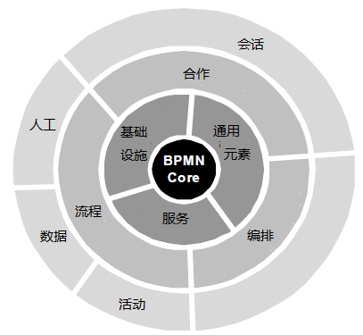

* BPMN2-Conformance一致性

1. Process Modeling Conformance(流程模型一致性)
2. Process Execution Conformance(流程执行一致性)
3. BPEL Process Execution Conformance(BPEL流程执行一致性)
4. Choreography Modeling Conformance(编排模型一致性)

* BPMN2-Diagram Types 流程图类型

1. Private Processes 私有流程
2. Public Processes 共有流程
3. Choreographies Processes 组合流程


### （2）流程元素

我们知道，BPMN2.0是通过**XML**语言来指定业务流程的可执行语法。所以这里有一段最简单的业务流程定义，尽管它还没有内容的。

xml文件：

```xml
<definitions id="myProcess"
    xmlns:xsi="http://www.w3.org/2001/XMLShema-instance"
    xsi:schemaLocation="http://schema/omg.org/spec/BPMN/2.0 BPMN20.xsd"
    xmlns="http://schema.omg.org/spec/BPMN/2.0"
    typeLanguage="http://www.w3.org/2001/XMLSchema"
    expressionLanguage="http://www.w3.org/1999/Xpath"
    targetNamespace="http://jpbm.org/example/bpmn2"
>

<process id="My Bussiness Process" name="myBussinessProcess">
    ....<!-- 基本结构-->
</process>

</definitions>
```
流程的根元素是：definitions元素。在命名状态，子元素会包含真正的业务流程定义。每个process子元素，可以拥有一个id（必填）和name（选填）。

### （3）基本结构（流程定义的基本要素）

遵循BPMN2.0新规范的工作流产品能很大程度上解决此类问题，BPMN2.0相对于旧的1.0规范以及XPDL，BPML和BPEL等最大的区别是定义了规范的执行语义和格式，利用标准的图元去描述真实的业务发生过程，保证相同的流程在不同的流程引擎得到的执行结果一致。BPMN2.0对流程执行语义定义了三类基本要素，他们是业务流程的“三板斧”。

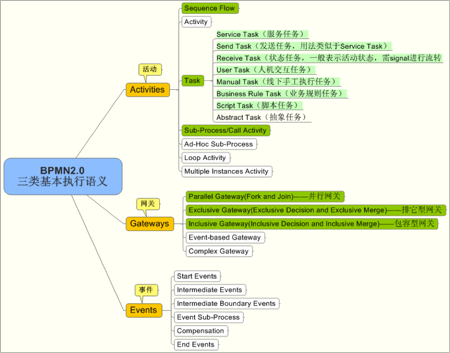

#### 1.Activities活动

 Activities活动，在工作流中所有具备生命周期状态的都可以成为“活动”，如原子级任务（Task），序列流（Sequence flow），以及子流程（Sub-Process）等。

 Task和Sub-Process的符号表示参考：

 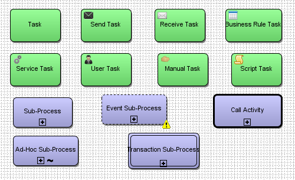

##### （1）Sequence Flow序列流

序列流是事件，活动和网关之间的连线，显示为一条实线 带有箭头， 每个顺序流都有一个源头和一个 目标引用，包含了 活动，事件或网关的id。

例如xml中定义一个序列流：
```xml
<sequenceFlow id="myFlow" name="My Flow"
        sourceRef="sourceId" targetRef="targetId" />

```

当有多个外向序列流的行为。如

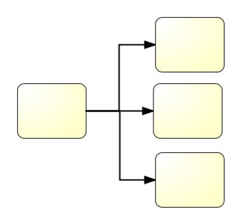

此时应该在每条序列流上设置流程参数，根据参数条件决定执行哪一条序列流；或者使用网关的形式予以拆分。


**默认序列流**

活动（比如用户任务）和网关（比如唯一网关）可以使用默认序列流流。 默认序列流只会在活动或网关的所有其他外向序列流的condition条件为false时才会使用。 默认序列流图形像是序列流多了一个斜线标记。

默认序列流通过指定活动或网关的 ‘default’ 属性来使用。

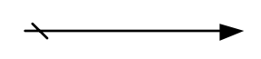

序列流是BPMN2.0中的Connecting Flow Objects（连接流对象），除此之外，还有Message Flow（消息流）、Associations（关联关系）、Data Associations（数据关联）。

**Message Flow（消息流）**

Message Flows 用虚线空心箭头表示，用于2个分开的流程参与者直接发送或者接收到的消息流.

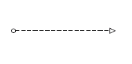

**Associations（关联关系）、Data Associations（数据关联）**

Associations 用点状虚线表示，用于显示活动的输入输出，关联上的箭头表示流动方向（比如：数据）。

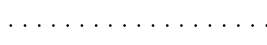

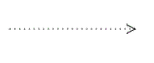

##### （2）Task任务

 任务是工作流中的原子活动。当流程中的工作不能被细分为更精细的细节时，将使用任务。通常，最终用户和/或应用程序在被用来执行任务。

 有哪些任务语义：
 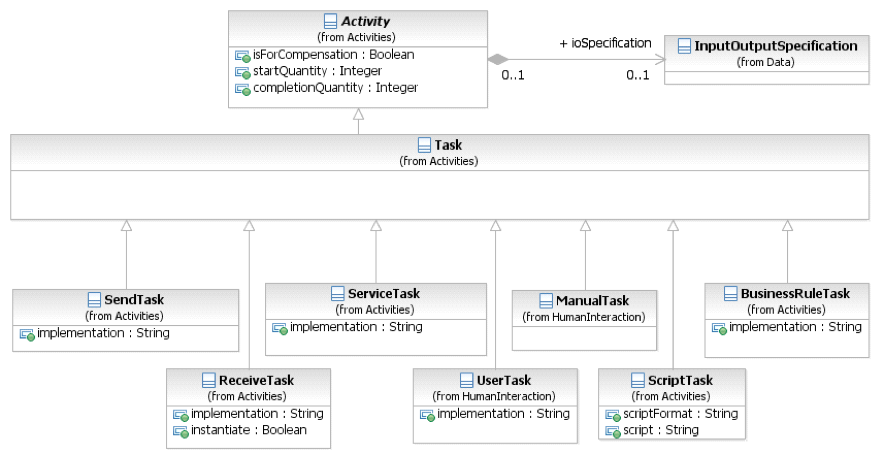
 
以下对相关任务做简单进行说明：

**①MunualTask手动任务**

手动任务是不受任何业务流程引擎管理的任务。它可以被认为是一个非托管任务，不受管理的意义在于业务流程引擎不跟踪此类任务的开始和完成。此类任务不参与实际工作流流转。常用于诸如物流系统中的装货，运顺等任务的描述。


**②UserTask用户任务**

UserTask用户任务是典型的“工作流”任务,也可以叫“人机交互任务”。人员在软件应用程序的帮助下执行任务。任务的生命周期有软件组件（任务管理器）管理，通常在进程的上下文中执行。主要用来描述人为在软件系统中进行诸如任务明细查询、填写审批意见等业务行为的操作，流程引擎流转到此类节点时，系统会自动生成被动触发任务，需人工响应后才能继续向下流转。

用户任务可以把任务分配给个人，组，角色组来执行，在定义用户任务时指定，完成相应工作后，用户任务完成。

**③ServiceTask服务任务**

ServiceTask服务任务是某种使用了服务的任务，可以是Web服务或自动应用程序。它是一个自动活动，它会调用一些服务，比如web service、java service等等。

通常在工作流流转的过程中会涉及到与自身系统服务的API调用或外部服务调用的情况，此类任务往往由一个特定业务服务功能的Java类来承担，与UserTask不同，流程引擎经此节点会自动调用Java类中定义的方法，方法执行完毕自动向下一流程节点流转。另外，此类任务还可充当“条件路由”的功能对流程流转可选分支进行自动判断。常用于业务逻辑API的调用。

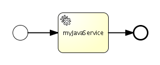

> 此外，当服务任务引用一个操作时，会引入以下约束：  
> 1.服务任务只有一个inputSet和最多一个outputSet。它具有单个数据输入，其ItemDefinition等同于由相关联操作的inMessageRef属性引用的消息定义的数据输入。    
> 2.如果操作定义输出消息，则服务任务具有单个数据输出，其具有与由相关联的操作的outMessageRef属性引用的消息定义的ItemDefinition相同的数据输出。  
> 使用服务的实际参与者可以通过使用过程的定义协作中的消息流将服务任务连接到参与者来识别

我们来看一个例子：

在XML文件中定义一个服务任务：
```xml
<serviceTask id="MyServiceTask" name="My service task"
  implementation="Other" operationRef="myOperation" />
<!-- 
implementation:此属性指定将用于发送和接收消息的技术。有效值是“## unspec”，用于使实现技术打开，Web服务技术的“## WebService”或标识任何其他技术或协调协议的URI。 Web服务是默认技术。
可选值是WebService, Other或者Unspecified。 这里选择Other（java调用）。
operationRef：此属性指定由服务任务调用的操作。
-->
```

一个接口实例：
```xml
<interface id="myInterface"
    name="org.jbpm.MyJavaServicek">
    <operation id="myOperation" name="myMethod">
      <inMessageRef>inputMessage</inMessageRef>
      <outMessageRef>outputMessage</outMessageRef>
    </bpmn:operation>
</interface>
<!-- 
服务任务将调用一个操作，operation的id 会在operationRef属性中引用
每个操作都至少有一个 输入信息，并且最多有一个 输出信息。
对于Java服务，接口的名称用来 指定java类的全类名。操作的名称 用来指定将要调用方法名。 输入/输出信息表示着java方法的参数/返回值
-->
```

**④RecieveTask接收任务**

接收任务是一个简单任务，它会等待对应消息的到达。一旦接收消息，任务完成。接收任务通常用于启动进程。
可以通过使用接收任务连接到参与者来识别接收到消息的实际参与者。

当流程达到接收任务，流程状态会保存到数据库中。

在任务创建后，以为着流程会进入等待状态，直到引擎接收一个特定的消息，这会触发流程穿过接受任务继续执行。

**⑤SendTask发送任务**

SendTask发送任务是一个简单的任务，旨在向外部参与者发送消息。消息发送完毕后，任务完成。
可以通过使用发送任务连接到参与者来识别发送消息的实际参与者。

**⑥ScriptTask脚本任务**

脚本任务是一个自动活动，由业务流程引擎执行。建模器或实现者使用引擎可以解释的语言定义脚本。当Task启动时，引擎将执行该脚本。脚本完成后，任务也将完成。

目前支持的脚本类型有三种：JUEL（JSP EL）、Groovy、JavaScript。在Activiti中还支持Shell Task，与Script由类似的功能。

**⑦Business Rule Task业务规则任务**

业务规则任务为流程提供了一种项业务规则引擎提供输入并获取业务规则引擎可能提供的计算输出的机制。该任务允许进程向“业务规则引擎”发送数据并从其接收数据。

##### （2）Sub-Process子流程(内嵌子流程)

子流程是一个活动，其内部细节使用活动，网关，事件和序列流进行建模。 子流程是流程内的图形对象，但也可以“打开”以显示较低级别的流程。 子流程定义可用于属性可见性，事务范围，异常处理，事件或弥补的上下文范围。

子流程的第一目的是实现流程的“继承”，意味着 设计者可以创建多个不同“级别”的细节。顶级视图理解为做一件事情的最高级别方式，最低的级别 就关注具体细节。

这是一个折叠子流程：


这是一个展开的子流程

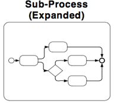

下面我们来看一个例子，在这个模型里，只有最高级的步骤显示出来。 实际的实现”Check credit”步骤隐藏在折叠子流程中。在实际与用户交流业务的过程中，落实主要的业务流程，再去落实每个可能涉及的子流程业务细节。

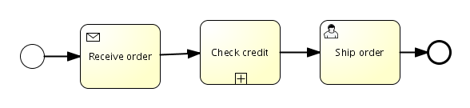

“Check credit”子流程展开是这样的：

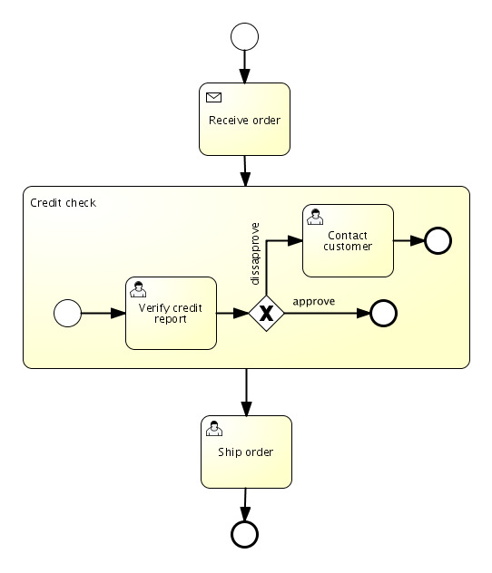

这个流程用xml文件描述就是：

```xml
<process id="embeddedSubprocess">
    <startEvent id="theStart" />
    <sequenceFlow id="flow1" sourceRef="theStart" targetRef="receiveOrder" />
    <receiveTask name="Receive order" id="receiveOrder" />
    <sequenceFlow id="flow2" sourceRef="receiveOrder" targetRef="checkCreditSubProcess" />
    <subProcess id="checkCreditSubProcess" name="Credit check">
      ...<!-- 子流程细节-->
    </subProcess>
    <sequenceFlow id="flow9" sourceRef="checkCreditSubProcess" targetRef="theEnd" />
    <endEvent id="theEnd" />
</process>

```

再看一个例子：

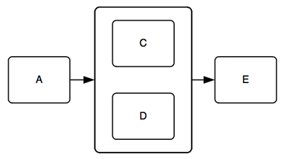

扩展的子流程可以用作以较不混乱，更紧凑的方式显示一组并行活动的机制。活动“C”和“D”包含在未标记的扩展子流程中。这两个活动将并行执行。

BPMN指定了五种类型的子流程的标准标记。 （折叠）子流程标记，可以与四个其他标记组合使用：循环标记、多实例标记、弥补标记、Ad-Hoc标记。在所有组合中，折叠的子流程可能有一到三个这些其他标记，除了循环和多实例不能同时显示。  

下面是组合使用的部分情形：

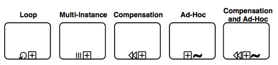


除此之外，还有其他的子流程类型，比如Event Sub-Process（事件子流程）、Transaction Sub-Process(事务子流程)。

**Event Sub-Process（事件子流程）**

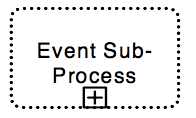

**Transaction Sub-Process(事务子流程)**

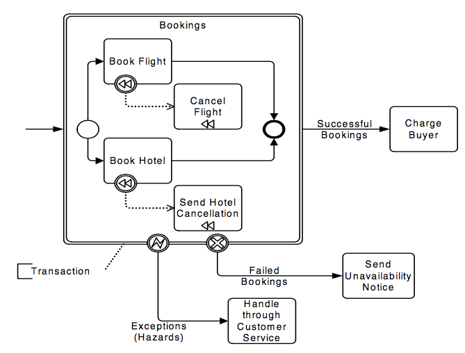 


#### 2.Gateways网关

网关用于控制序列流在流程内的合并和拆分的相互作用，用来控制流程流转的指向的。如果不需要控制流程则不需要网关。更确切的说，当一个token（令牌）到达一个网关，它会根据网关的类型进行合并和拆分。

网关的符号表示参考：

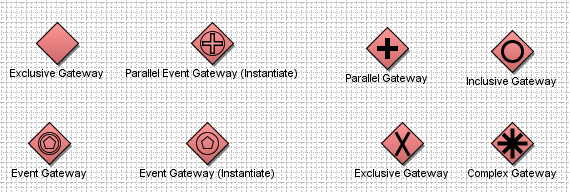

所有的网关类型，都可以设置gatewayDirection。取值：
> * unspecificed (默认)：网关可能拥有多个 进入和外出顺序流。
> * mixed：网关必须拥有多个 进入和外出顺序流。
> * converging：网关必须拥有多个进入顺序流， 但是只能有一个外出顺序流。
> * diverging：网关必须拥有一个进入顺序流， 和多个外出顺序流。


**①Exclusive Gateway排它网关（互斥网关）**

排它网关表达了一个流程中的唯一决策。 根据定义在顺序流中的条件,选择符合条件的下一流程流向。

我们来看一个例子：

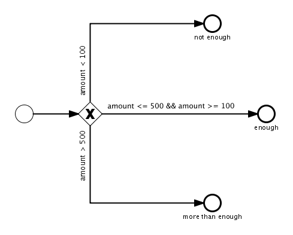

根据amount变量的值， 会选择唯一网关外向的三个外向顺序流 中的一个。  

一般情况下，排它网关需要所有外向顺序流上都定义条件。 但是，有一种例外是默认顺序流， 在网关定义时使用default 属性来引用一个已存在的顺序流的id。当其他外向顺序流的条件都执行为false时，这个顺序流就会被使用。

**②Exclusive Gateway并行网关**

并行网关用来切分或同步相关的进入或外出顺序流。

我们来看一个例子：

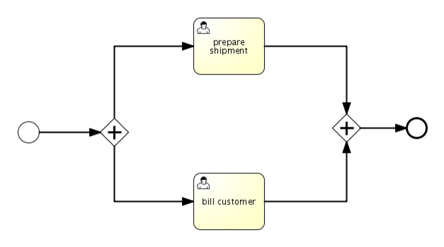

注意：当流程启动时，在流程启动后， ‘prepare shipment’ 和 ‘bill customer’用户任务都会被激活，同时往下执行。当到达合并节点时，需要两个流程实例都完成，才能继续往下执行。

**③Inclusive Gateway包容网关**

Inclusive Gateway包含网关， 被用来 进行“条件性”切分或汇聚顺序流。它基本的行为就和一个并行网关一样， 但是它也可以统计条件，在外出顺序流上（切分行为） 和计算，如果这儿有流程离开，可以到达网关（合并行为）。

建议：最佳实践是让包含网关成对使用。

我们看下面这个例子：

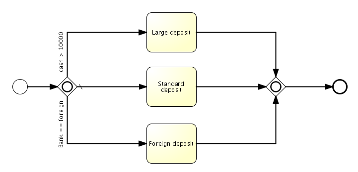

针对以上的例子，作出解释如下：
* 现金多于10000，不是国外银行：只有 “Large deposit” 任务会被激活。
* 现金多于10000，是国外银行： “Large deposit” 和 “Foreign deposit” 任务会被激活。
* 现金少于10000，是国外银行： 只有 “Foreign deposit” 任务会被激活。
* 现金少于10000，不是国外银行： 在这种情况 所有表达式的结果都是false，默认的顺序流会被选择。 在这个例子中国，这意味着”Standard deposit”任务会被激活。

无论在包含网关之后多少任务被激活，右侧的聚合包含网关会等到左侧的包含网关所有外向顺序流到达合并网关。    
和其他网关类型一样，包含网关类型可以同时拥有合并和切分行为。 在这种情况下，包含网关将先等到所有分支流程到达，

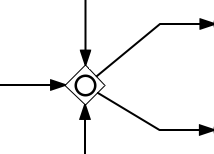

#### 3.Events事件
事件在实际的每个业务流程中都会使用。 事件让业务建模工具用很自然的方式描述业务流程。  

> 比如 ‘当我接收到客户的订单，这个流程就启动’， ‘如果两天内任务没结束，就终止流程’ 或者‘当我收到一封取消邮件，当流程在运行时， 使用子流程处理邮件’。  

注意典型的业务通常使用这种事件驱动的方式。人们不会硬编码顺序创建， 但是他们倾向于使用在他们的环境中发生的事情（比如，事件）。 为了覆盖可能的事情， 在业务环境中可能出现的情况,在BPMN规范中，描述了很多事件类型.

##### (1)Start Event开始事件（启动事件）

开始事件指定流程将在哪里开始。在序列流方面，启动事件启动进程的流程，因此不会有任何进入的序列流。

Start Event可以用于这些类型的流程：
* 顶级流程
* 嵌入式的子流程
* 全局流程
* 事件子流程

一些建议和说明：

* 启动事件的使用对于每个流程的每个级别都是独立的。
* 如果流程复杂和/或启动条件不明显，则建议使用启动事件。
* 如果不使用启动事件，则该进程的隐式启动事件不应该具有触发器。
* 如果有结束事件，则必须至少有一个结束事件。

不同类型的流程可以使用的启动事件的类型不同：

**①顶级流程Top-Level Process Start Event Types**

|Trigger|Mark|
|:----|:-----:|
|None空启动事件||
|Message消息启动事件||
|Timer定时启动事件||
|Conditional条件启动事件||
|Signal信号启动事件||
|Multiple多个启动事件||
|Parallel Multiple并行多个启动事件||

**②嵌入式的子流程Start Events for Sub-Processes**

|Trigger|Mark|
|:----|:-----:|
|None空启动事件||

**③事件子流程Start Events for Event Sub-Processes**

|Trigger|Mark|
|:----|:-----:|
|Message消息启动事件|  |
|Timer定时启动事件|  |
|Escalation升级启动事件|  |
|Error错误启动事件||
|Compensation赔偿启动事件||
|Conditional条件启动事件|  |
|Signal信号条件启动事件|  |
|Multiple多个条件启动事件|  |
|Parallel Multiple并行多个启动事件||

##### (2)End Event空结束事件

结束事件指定了流程实例中一个流程路径的结束。 

图形上，它看起来就是一个圆 拥有厚边框（可能） 内部有小图标。 图标指定了结束的时候 会执行哪种操作。

当流程到达事件时，不会抛出任何信号。 

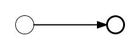

空结束事件可以像下面一样定义，id是必填的，name是可选的。

```xml
<endEvent id="end" name="myEnd" />
````    

下面的例子显示了只使用空开始和结束事件的流程：
 ```xml
  <process id="noneStartEndEvent" name="BPMN2 Example none start and end event">

    <startEvent id="start" />

    <sequenceFlow id="flow1" name="fromStartToEnd"
      sourceRef="start" targetRef="end" />

    <endEvent id="end" name="End" />

  </process>
```

##### (3)Terminate End Event终止结束事件

终止和空结束事件的区别是 实际中流程的路径是如何处理的（或者使用BPMN 2.0的术语叫做token）。 终止结束事件会结束整个流程实例，而空结束事件只会结束当前流程路径。 他们都不会抛出任何事情 当到达结束事件的时候。


一个终止结束事件可以像下面定义。id是必填的，name是可选的。
```xml
<endEvent id="terminateEnd" name="myTerminateEnd">
  <terminateEventDefinition/>
</endEvent>
```

终止结束事件被描绘成结束事件一样（圆，厚边框）， 内部图标时一个完整的圆。在下面的例子中，完成task1 会结束流程实例，当完成task2时只会结束到达结束事件 的流程路径，只剩下task1打开。

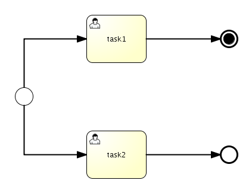

### （4）除了三类基本执行语义的扩展内容

#### 1.Data数据

* ①.Data Objects 数据对象
* ②.Data Inputs 数据输入
* ③.Data OutPuts 数据输出
* ④.Data Stores 数据存储

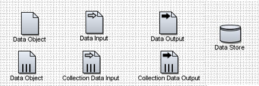

#### 2.Swimlanes泳道

**①.Pools 泳池**
 
描述流程中的一个参与者。可以看做是将一系列活动区别于其他池的一个图形容器，一般用于B2B的上下文中。

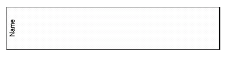

**②.Lanes 泳道** 

泳道就是在池里面再细分，可以是垂直的也可以是水平的，泳道也用于组织和分类活动。

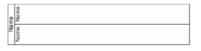

#### 3.Artifacts工件

**①.Group 组**
 
 

**②.Text Annotation 文本注释**

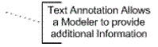

### （5）一个具体的例子

这是一个常见的请假业务流程定义。

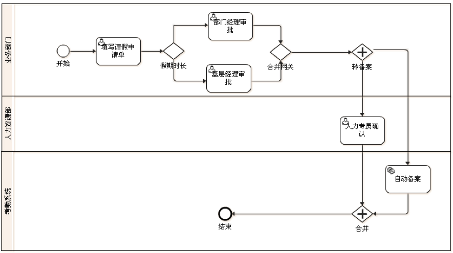

这个例子中所所用流程定义说明：

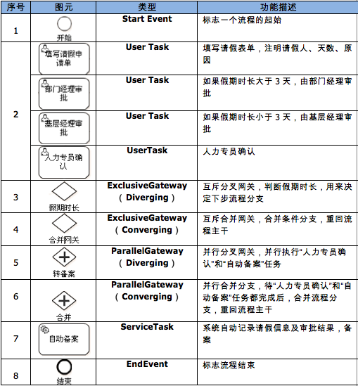

### （6）BPMN2.0术语
附件：[BPMN2术语表](http://172.18.3.103/aneid/docs/tree/master/03_技术准备/支撑服务/工作流/docs/bpmn/BPMN2术语表.docx)