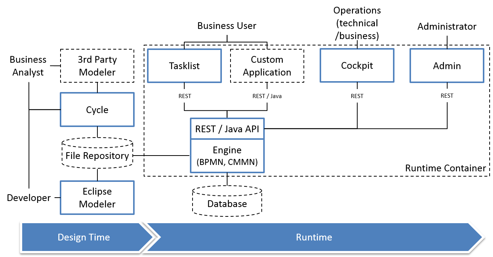
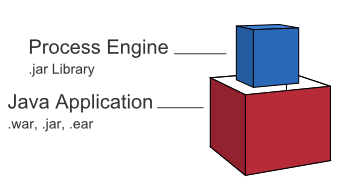
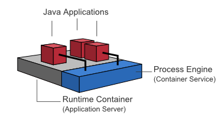
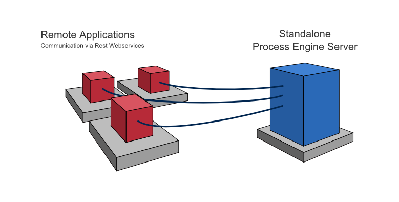

# Camunda BPM基本概念
## 一、基本介绍

历史聚焦：2012年，Camunda宣布从Activiti分裂出一个新的开源工程，那就是Camunda BPM。

Camunda BPM平台是工作流和过程自动化的灵活框架。它的核心是在Java虚拟机中运行的本机BPMN 2.0流程引擎。它可以嵌入到任何Java应用程序和任何运行时容器中。它与Java EE 6集成，是Spring框架的完美匹配。在流程引擎之上，您可以从一堆工具中进行人为工作流管理，操作和监控。

Camunda BPM是一个基于Java的框架。主要组件以Java编写，我们一般侧重于为Java开发人员提供在JVM上设计，实施和运行业务流程和工作流所需的工具。然而，我们也希望使流程引擎技术可用于非Java开发人员。这就是为什么Camunda BPM还提供了一个REST API，它允许您构建连接到远程进程引擎的应用程序。

Camunda BPM既可用作独立的流程引擎服务器，也可以嵌入到定制的Java应用程序中。

Camunda BPM围绕流程引擎组件构建。下图显示了Camunda BPM的最重要组件以及一些典型的用户角色。

 
流程引擎和基础设施

* 流程引擎，流程引擎是一个负责执行BPMN 2.0流程和工作流程的java库。它具有轻量级的POJO核心，并使用关系数据库进行持久化。ORM映射由mybatis映射框架提供。
* Spring框架集成
* CDI / Java EE集成
* 运行时容器集成（与应用程序服务器基础架构集成）

Web应用程序

* REST API， REST API允许您使用来自远程应用程序或JavaScript应用程序的进程引擎。（注意：REST API的文档被分解到自己的文档中。）
* Camunda Tasklist，用于人工流程管理和用户任务的Web应用程序，允许进程参与者检查其工作流任务并导航到任务表单，以便处理任务并提供数据输入。
* Camunda Cockpit，用于进程监视和操作的Web应用程序，可让您搜索进程实例，检查其状态并修复损坏的实例。
* Camunda Admin，用户管理的Web应用程序，允许您管理用户，组和授权。
* Camunda Cycle，用于在不同建模工具和建模者之间同步BPMN 2.0过程模型的Web应用程序。

附加工具

* Camunda Modeler：用于进程建模的Eclipse插件。
* bpmn.io：BPMN Web建模器，用于我们的Web应用程序Cockpit和Tasklist，用于在浏览器中呈现BPMN 2.0进程模型。虽然bpmn.io仍在开发中，但它的API相当稳定。

## 二、Camunda BPM平台架构

Camunda BPM平台是一个灵活的框架，可以在不同的场景下部署。

### 1.嵌入式流程引擎架构

在这种情况下，流程引擎作为应用程序库添加到自定义应用程序。这样，流程引擎可以轻松地在应用程序生命周期中启动和停止。可以在共享数据库之上运行多个嵌入式流程引擎。

### 2.共享的，容器管理的流程引擎架构

在这种情况下，流程引擎在运行时容器（Servlet Container，Application Server，...）中启动。流程引擎作为容器服务提供，并且可以由部署在容器内部的所有应用程序共享。该概念可以与运行时提供的JMS消息队列进行比较，并可由所有应用程序使用。流程部署和应用程序之间存在一对一映射：流程引擎跟踪应用程序部署的流程定义，并将执行委托给相关应用程序。

### 3.独立（远程）流程引擎服务器架构

在这种情况下，流程引擎被提供为网络服务。在网络上运行的不同应用程序可以通过远程通信通道与进程引擎进行交互。使进程引擎可远程访问的最简单方法是使用内置的REST API。不同的通信渠道如SOAP Webservices或JMS是可行的，但需要由用户来实现。

## 三、Web应用程序架构
Camunda BPM Web应用程序基于RESTful架构。

使用的框架：
* 基于JAX-RS的Rest API
* AngularJS
* RequireJS
* jQuery
* Twitter Bootstrap

由camunda黑客开发的其他自定义框架：
* camunda-bpmn.js：Camunda BPMN 2.0 JavaScript库
* ngDefine：将AngularJS集成到RequireJS为动力的应用程序中
* angular-data-depend：用于实现复杂数据的，繁重的AngularJS应用程序的工具包

## 四、支持的环境

### 1.运行时组件的容器/应用程序服务器（除Camunda Cycle）

* Apache Tomcat 6/7
* JBOSS Application Server 7.2和JBOSS EAP 6.1~6.4
* Wildfly 8.1/8.2 Application Server
* GlassFish 3.1
* IBM WebSphere Application Server 8.0/8.5(Enterprise Edition Only)
* Oracle WebLogic Server 12c(Enterprise Edition Only)

### 2.数据库

不支持集群或复制数据库，除非它们的行为与相应的非集群/非复制配置完全相同。配置需要保证READ-COMMITTED的隔离级别。不支持基于MySQL / MariaDB的Galera Cluster。

* MySQL 5.1 / 5.5 / 5.6
* MariaDB 10.0
* Oracle 10g / 11g / 12c
* IBM DB2 9.7 / 10.1 / 10.5（不包括所有版本的IBM z / OS）
* PostgreSQL 9.1 / 9.3 / 9.4
* Microsoft SQL Server 2008 R2 / 2012/2014（请参阅配置注意事项）
* H2 1.3

### 3.网页浏览器

* Google Chrome最新
* Mozilla Firefox最新
* Internet Explorer 9/10/11

### 4.Java的

* Java 6/7
* Java 8（如果您的应用程序服务器/容器支持）

### 5.Java运行时
* Sun / Oracle Hot Spot 6/7/8
* IBM®J9虚拟机（JVM）6/7/8
* OpenJDK 6/7
* Oracle JRockit 6 - R28.2.7

Eclipse（用于camunda modeler）

* Eclipse Indigo / Juno / Kepler

## 五、社区和企业扩展

### 1.社区扩展
Camunda BPM由Camunda开发，作为与社区合作的开源项目。“核心项目”（即“Camunda BPM平台”）是Camunda作为商业产品提供的Camunda BPM产品的基础。商业Camunda BPM产品包含额外的（非开源）功能，并向Camunda BPM客户提供诸如企业支持和错误修复版本等服务。  
Camunda支持社区努力在Camunda BPM旗下建立额外的社区扩展。这种社区扩展由社区维护，不属于商业Camunda BPM产品的一部分。Camunda不支持社区扩展作为其对企业订阅客户的商业服务的一部分。

社区扩展名单

以下是目前（不支持）社区扩展程序的列表：

* Apache Camel Integration
* AssetJ Testing Library
* Grails Plugin
* Needle Testing Library
* OSGi Integration
* Elastic Search Extension
* PHP SDK
* Tasklist Transactions
* Cycle Connectors
* Single Sign On For JBOSS
* Camunda BPM Platform Docker Images
* Camunda Process Test Coverage

### 2.企业扩展

XSLT扩展

XSLT扩展程序取决于以下第三方库：
* SAXON （Mozilla Public Licence（公共许可证）2.0）

## 六、用户操作日志
用户操作日志包含许多API操作的条目，可用于审计。它提供有关执行什么样的操作的数据以及操作中涉及的更改的详细信息。无论操作是否在登录用户的上下文中执行（例如，在作业执行期间），都会记录操作。要使用操作日志，必须将流程引擎历史级别设置为FULL。
### 1.访问用户操作日志
可以通过Java API访问用户操作日志。运行时服务可用于`UserOperationLogQuery`通过调用来执行`runtimeService.createUserOperationLogQuery().execute()`。可以通过各种过滤选项限制查询。查询也暴露在REST API中。
### 2.用户操作日志条目
日志由操作和条目组成。一个操作对应于一个执行的操作，并由许多条目组成，至少一个。条目包含作为操作的一部分的详细更改。当进行用户操作日志查询时，返回的实体是类型`UserOperationLogEntry`，对应于条目。一个操作的多个条目通过操作标识链接。
用户操作日志条目具有以下属性：
* 操作类型：执行操作的标识符。可用的操作类型列在接口`org.camunda.bpm.engine.history.UserOperationLogEntry`中。
* 操作ID：唯一标识执行操作的生成的id。作为一个操作的一部分的多个日志条目引用相同的操作ID。
* 实体类型：由操作寻址的实体的类型的标识符。可用的实体类型列在类`org.camunda.bpm.engine.EntityTypes`中。
* 实体ID：作业日志条目包含用于标识操作寻址的实体的实体ID。例如，任务上的操作日志条目包含任务的id以及任务所属的进程实例的id。作为第二个示例，用于挂起流程定义的所有流程实例的日志条目不包含单独的流程实例ID，而只包含流程定义ID。
* 用户ID：执行操作的用户的ID。
* 时间戳：执行操作的时间。
* 已更改属性：用户操作可能会更改多个属性。例如，暂停进程实例会更改挂起状态属性。为操作中涉及的每个属性创建一个日志条目。
* 旧属性值：更改属性的上一个值。甲 null值或者表示该属性先前null或不知道。
* 新属性值：已更改属性的新值。

### 3.登录用户操作日志的操作术语表

以下描述了用户操作日志中记录的操作和作为其一部分创建的条目：

## 七、数据格式(XML、JSON其他)