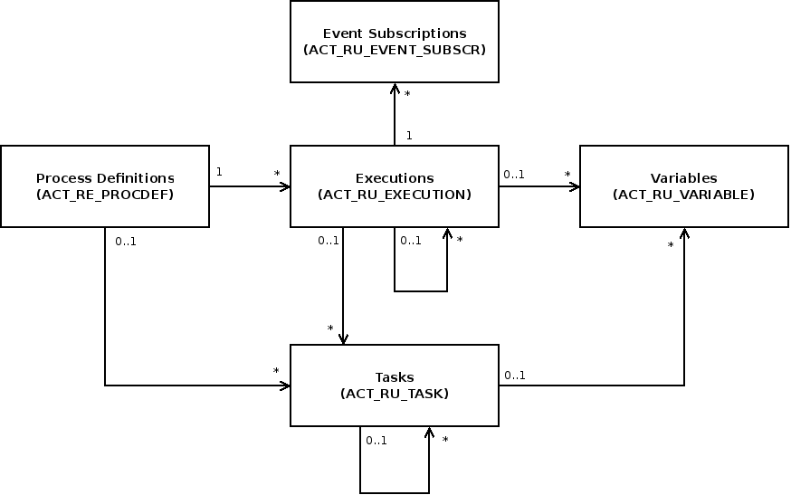
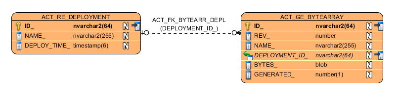
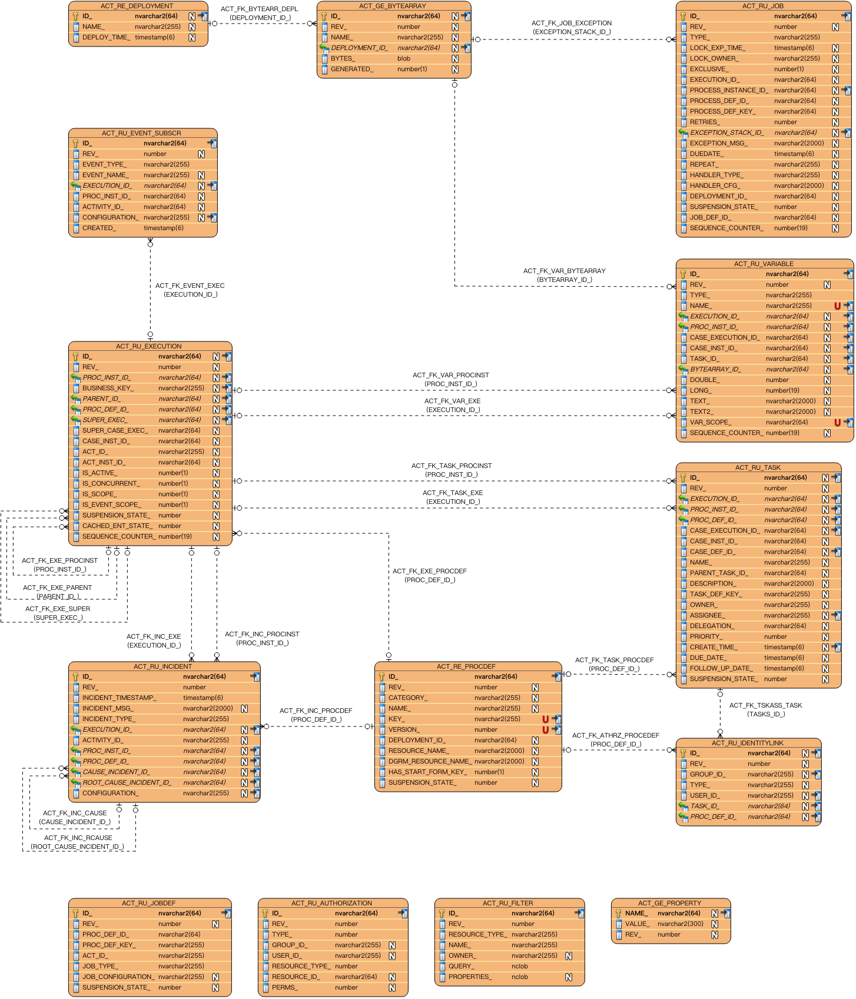
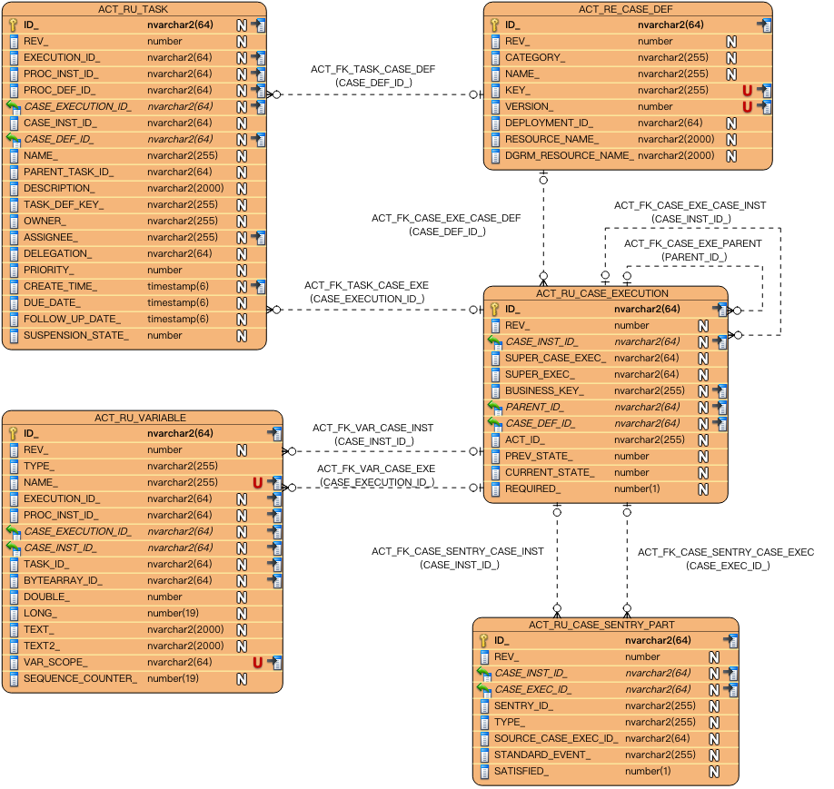
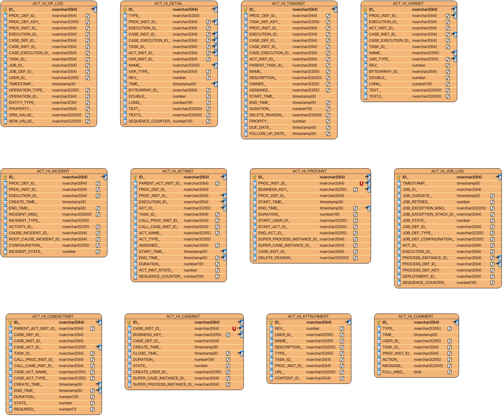
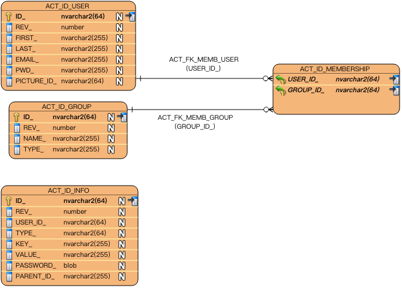

# DataBase 数据库

## 一、DataBase Support支持的数据库

不支持集群或复制数据库，除非它们的行为与相应的非集群/非复制配置完全相同。配置需要保证READ-COMMITTED的隔离级别。不支持基于MySQL / MariaDB的Galera Cluster。

* MySQL 5.1 / 5.5 / 5.6
* MariaDB 10.0
* Oracle 10g / 11g / 12c
* IBM DB2 9.7 / 10.1 / 10.5（不包括所有版本的IBM z / OS）
* PostgreSQL 9.1 / 9.3 / 9.4
* Microsoft SQL Server 2008 R2 / 2012/2014（请参阅配置注意事项）
* H2 1.3

## 二、DataBase Schema 数据库架构

流程引擎的数据库模式由多个表组成。表名全部以ACT开头。第二部分是表示表的用途的两个字母标识。用途也和服务的API对应。

* ACT_RE_*：RE代表Respository。具有此前缀的表包含流程定义和流程静态资源（图片，规则等）。
* ACT_RU_*：RU代表Runtime。这些是运行时的表，其中包含流程实例，用户任务，变量，任务等的运行时数据。流程引擎仅在流程实例执行期间存储这些数据，这样运行时表可以一直很小速度很快。
* ACT_ID_*：ID代表Identity。这些表包含身份信息，如用户，组等。
* ACT_HI_*：HI代表History。这些是包含历史数据的表，例如历史流程实例，变量，任务等。
* ACT_GE_*：通用数据，用于不同场景下，比如存放资源文件。

流程引擎的表主要是流程定义，执行，任务，变量和事件订阅的实体。他们的关系显示在以下UML模型中。



### 1.Process Definition 流程定义（ACT_RE_PROCDEF）

该ACT_RE_PROCDEF表包含所有已部署的流程定义。它包括诸如版本详细信息，资源名称或挂起状态的信息。

### 2.Process Excution 执行（ACT_RU_EXECUTION）

该ACT_RU_EXECUTION表包含当前所有执行实例。它包括流程定义，父执行，业务密钥，当前活动以及有关执行状态的不同元数据等信息。

### 3.Task 任务（ACT_RU_TASK）

该ACT_RU_TASK表包含所有正在运行的流程实例中所有打开的任务。它包括相应的流程实例和执行信息，以及元数据作为创建时间，办理人或到期日。

### 4. Variables 变量（ACT_RU_VARIABLE）

该ACT_RU_VARIABLE表包含所有当前流程或任务所设置的变量。它包括变量的名称，类型和值以及有关相应流程实例或任务的信息。

### 5.Event Subscriptions 事件订阅（ACT_RU_EVENT_SUBSCR）

该ACT_RU_EVENT_SUBSCR表包含所有当前存在的事件订阅。它包括预期事件的类型，名称和配置以及有关相应流程实例和执行的信息。

## 三、Entity Relationship Diagrams 实体关系图

> 注意：
> 1. 数据库不是Public API的一部分。数据库模式可能会针对MINOR和MAJOR版本更新而改变。 
> 2. 以下图表基于oracle数据库模式。对于其他数据库，图可能略有不同。
以下实体关系图可视化引擎分组的数据库表及其显式外键约束，基于BPMN的引擎，基于CMMN的引擎，History历史和Identity
身份。表之间的隐式连接不可见。



* 外键显示为箭头从一个实体指向另一个实体
* 箭头标签描述了外键的名称和括号中的数据库存储的名称
* 数据库存储名称在表格框中标有绿色箭头

### 1.Engine BPMN



### 2.Engine CMMN



### 3.History 历史

为了允许不同的配置并保持表格更加灵活，历史记录表不包含外键约束。



### 4.Identity 身份




## 四、Database Configuration 数据库配置

使用camunda引擎有两种方法可以配置数据库。第一个选项是定义数据库的JDBC属性：

* jdbcUrl：数据库的JDBC URL。
* jdbcDriver：执行驱动程序的具体数据库类型。
* jdbcUsername：用于连接数据库的用户名。
* jdbcPassword：连接数据库的密码。

**camunda引擎内部使用Apache MyBatis进行持久化。**

基于提供的JDBC属性构建的数据源将具有默认的MyBatis连接池设置。可以选择将以下属性设置为调整该连接池（来自MyBatis文档的相关内容）：

* jdbcMaxActiveConnections：连接池在任何给定时间可以包含的最大活动连接数。默认值为10。
* jdbcMaxIdleConnections：连接池在任何给定时间可以包含的最大空闲连接数。
* jdbcMaxCheckoutTime：在强制返回连接之前，连接可以从连接池“CheckOut”的时间（毫秒）的时间值。默认值为20000（20秒）。
* jdbcMaxWaitTime：这是一个低级别的设置，使连接池有机会打印日志状态，并重新尝试连接的获取，在长时间异常的情况下（如果池被配置错误，避免永远失败）默认是20000（20秒）。
* jdbcStatementTimeout：jdbc驱动程序等待数据库响应的时间（以秒为单位）。默认值为null，表示没有超时。

示例数据库配置：

```xml
<property name="jdbcUrl" value="jdbc:h2:mem:camunda;DB_CLOSE_DELAY=1000" />
<property name="jdbcDriver" value="org.h2.Driver" />
<property name="jdbcUsername" value="sa" />
<property name="jdbcPassword" value="" />
```

或者，javax.sql.DataSource可以使用实现（例如Apache Commons的DBCP）：

```xml
<bean id="dataSource" class="org.apache.commons.dbcp.BasicDataSource" >
  <property name="driverClassName" value="com.mysql.jdbc.Driver" />
  <property name="url" value="jdbc:mysql://localhost:3306/camunda" />
  <property name="username" value="camunda" />
  <property name="password" value="camunda" />
  <property name="defaultAutoCommit" value="false" />
</bean>

<bean id="processEngineConfiguration" class="org.camunda.bpm.engine.impl.cfg.StandaloneProcessEngineConfiguration">

    <property name="dataSource" ref="dataSource" />
    ...
```

注意，camunda不允许定义这样的数据源。所以你必须确保库（例如从DBCP）在你的类路径。

可以设置以下属性，无论是使用JDBC还是数据源的方式：

* databaseType：通常不需要指定此属性，因为它将从数据库连接元数据中自动分析。只有在自动检测失败的情况下才应指定。可能的值：{h2，mysql，oracle，postgres，mssql，db2}。不使用默认H2数据库时，此属性是必需的。此设置将确定将使用哪些创建/删除脚本和查询。
* databaseSchemaUpdate：允许在流程引擎启动和关闭时设置策略来处理数据库模式。
    + false （默认）：当创建流程引擎时，检查数据库模式对应数据库的版本，如果版本不匹配则抛出异常。
    + true：在创建流程引擎时，执行检查，并在必要时执行数据库模式的更新。如果模式不存在，则创建它。
    + create-drop：在创建流程引擎时创建模式，并在流程引擎关闭时删除模式。


以下是一些示例JDBC URL：
* h2：jdbc：h2：tcp：// localhost / camunda
* mysql：jdbc：mysql：// localhost：3306 / camunda？autoReconnect = true
* oracle：jdbc：oracle：thin：@localhost：1521：xe
* postgres：jdbc：postgresql：// localhost：5432 / camunda
* db2：jdbc：db2：// localhost：50000 / camunda
* mssql：jdbc：sqlserver：// localhost：1433 / camunda

## 五、Additonal database schema configuration 附加数据库模式配置

Bussiness key 业务密钥
自从发布camunda-bpm 7.0.0-alpha9以来，业务密钥的唯一约束是在运行时和历史表以及数据库模式中删除，创建和删除脚本。如果需要这些约束，则可以通过发出以下sql语句将其手动添加到数据库模式中：

DB2

```
Runtime:
alter table ACT_RU_EXECUTION add UNI_BUSINESS_KEY varchar (255) not null generated always as (case when "BUSINESS_KEY_" is null then "ID_" else "BUSINESS_KEY_" end);
alter table ACT_RU_EXECUTION add UNI_PROC_DEF_ID varchar (64) not null generated always as (case when "PROC_DEF_ID_" is null then "ID_" else "PROC_DEF_ID_" end);
create unique index ACT_UNIQ_RU_BUS_KEY on ACT_RU_EXECUTION(UNI_PROC_DEF_ID, UNI_BUSINESS_KEY);


History:
alter table ACT_HI_PROCINST add UNI_BUSINESS_KEY varchar (255) not null generated always as (case when "BUSINESS_KEY_" is null then "ID_" else "BUSINESS_KEY_" end);
alter table ACT_HI_PROCINST add UNI_PROC_DEF_ID varchar (64) not null generated always as (case when "PROC_DEF_ID_" is null then "ID_" else "PROC_DEF_ID_" end);
create unique index ACT_UNIQ_HI_BUS_KEY on ACT_HI_PROCINST(UNI_PROC_DEF_ID, UNI_BUSINESS_KEY);
```


H2

```
Runtime:
alter table ACT_RU_EXECUTION add constraint ACT_UNIQ_RU_BUS_KEY unique(PROC_DEF_ID_, BUSINESS_KEY_);

History:
alter table ACT_HI_PROCINST add constraint ACT_UNIQ_HI_BUS_KEY unique(PROC_DEF_ID_, BUSINESS_KEY_);
```


MSSQL

```
Runtime:
create unique index ACT_UNIQ_RU_BUS_KEY on ACT_RU_EXECUTION (PROC_DEF_ID_, BUSINESS_KEY_) where BUSINESS_KEY_ is not null;

History:
create unique index ACT_UNIQ_HI_BUS_KEY on ACT_HI_PROCINST (PROC_DEF_ID_, BUSINESS_KEY_) where BUSINESS_KEY_ is not null;
```

MySQL

```
Runtime:
alter table ACT_RU_EXECUTION add constraint ACT_UNIQ_RU_BUS_KEY UNIQUE (PROC_DEF_ID_, BUSINESS_KEY_);

History:
alter table ACT_HI_PROCINST add constraint ACT_UNIQ_HI_BUS_KEY UNIQUE (PROC_DEF_ID_, BUSINESS_KEY_);
```

oracle

```
Runtime:
create unique index ACT_UNIQ_RU_BUS_KEY on ACT_RU_EXECUTION
         (case when BUSINESS_KEY_ is null then null else PROC_DEF_ID_ end,
         case when BUSINESS_KEY_ is null then null else BUSINESS_KEY_ end);

History:
create unique index ACT_UNIQ_HI_BUS_KEY on ACT_HI_PROCINST
         (case when BUSINESS_KEY_ is null then null else PROC_DEF_ID_ end,
         case when BUSINESS_KEY_ is null then null else BUSINESS_KEY_ end);
```

Postgres

```
Runtime:
alter table ACT_RU_EXECUTION add constraint ACT_UNIQ_RU_BUS_KEY UNIQUE (PROC_DEF_ID_, BUSINESS_KEY_);

History:
alter table ACT_HI_PROCINST add constraint ACT_UNIQ_HI_BUS_KEY UNIQUE (PROC_DEF_ID_, BUSINESS_KEY_);
```

Microsoft SQL Server的自定义配置

Microsoft SQL Server实现了与大多数数据库不同的`READ_COMMITTED`隔离级别，并且不能与流程引擎的optimistic locking schema很好地结合在一起。因此，当流程引擎处于高负载状态时，可能会遇到死锁。

如果在MSSQL安装中遇到死锁，则必须执行以下语句才能启用SNAPSHOT隔离：

```
ALTER DATABASE [process-engine]
SET ALLOW_SNAPSHOT_ISOLATION ON

ALTER DATABASE [process-engine]
SET READ_COMMITTED_SNAPSHOT ON
```

其中`[process-engine]`包含数据库的名称。
