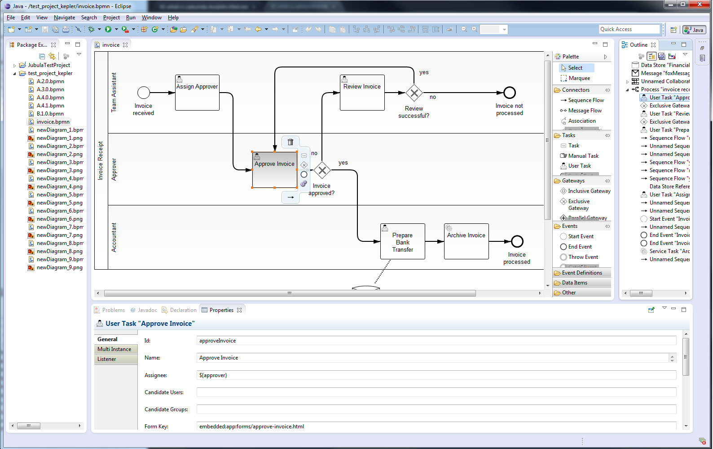
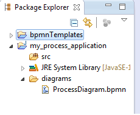
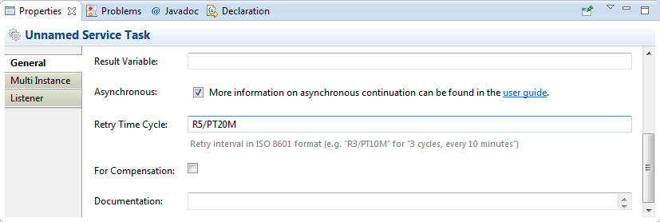
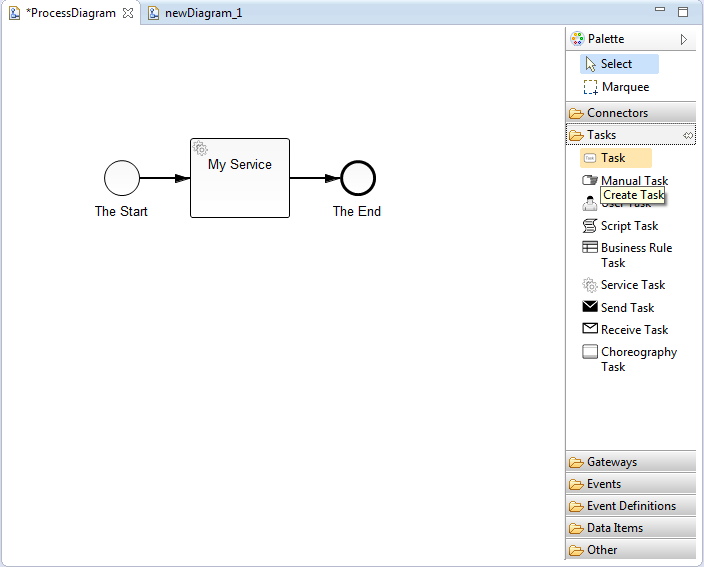
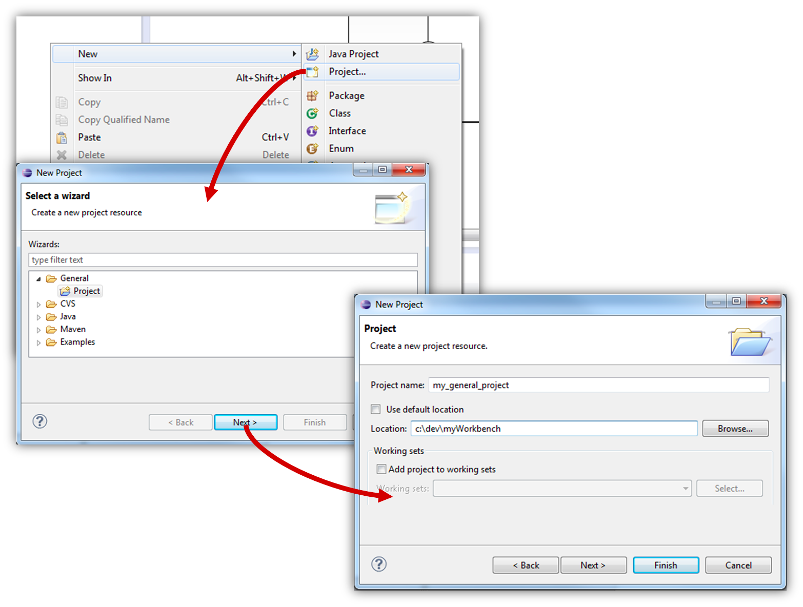
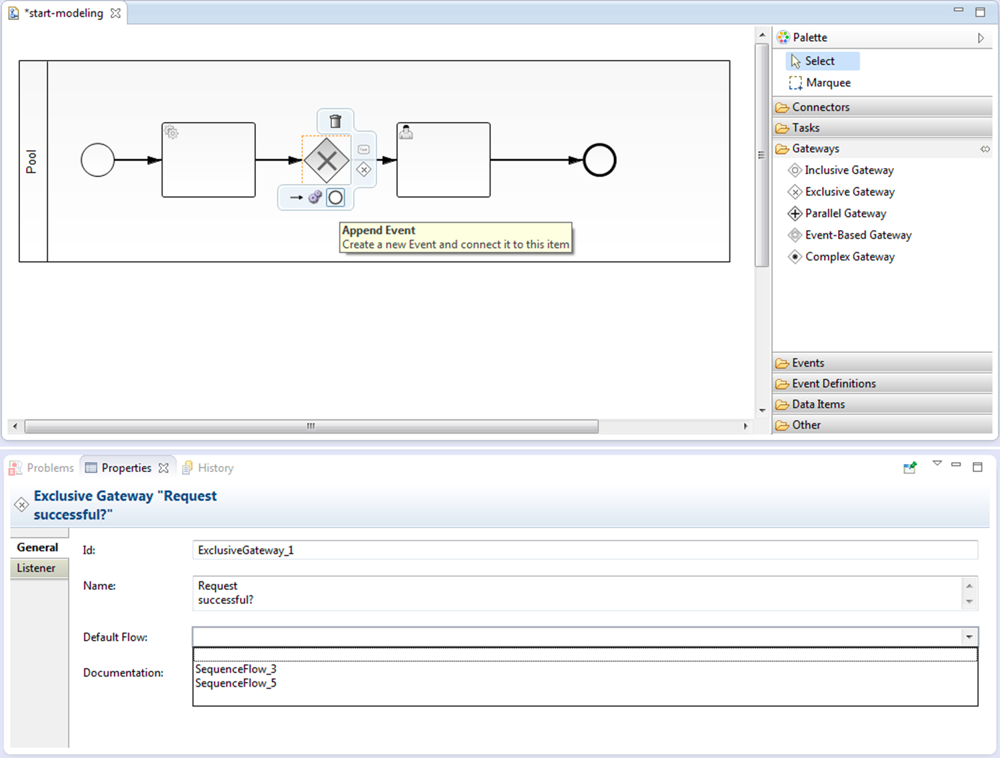
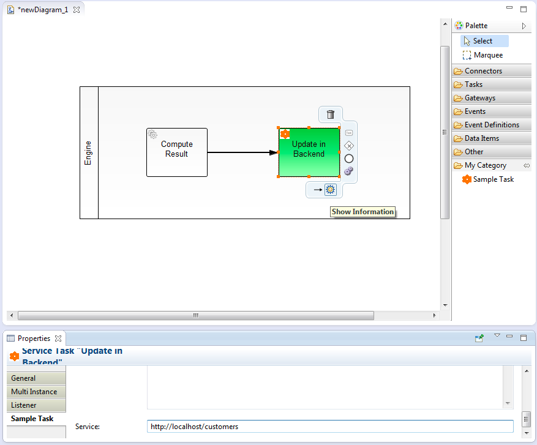

# Camunda Modeler 建模工具

## 一、Camunda Modeler 定义

Camunda Modeler是Eclipse的开源BPMN 2.0建模插件，专注于流程和协作图的无缝建模。camunda Modeler支持完整的BPMN 2.0标准。

## 二、Camunda Modeler 下载和安装

1.官网社区下载：http://camunda.org/download

2.插件：一般有两种安装方式可供选择（官网已废弃，但仍可使用）

* 直接在Eclipse插件界面搜素并安装
* 下载官网Camunda Modeler插件包拖入Eclipse的Dropins文件夹，重启即可。

## 三、Camunda Modeler 页面布局

### 1.Project Explore 项目浏览器

此视图提供了工作区中资源的分层视图。此处显示项目和文件。打开项目浏览器单击Window / Show View / Other... / General / Project Explorer。在Project Explorer中，您可以添加，删除和重命名文件。此外，您可以从或从资源管理器复制文件。

### 2.Properties Panel 属性面板

属性面板允许在面板中维护BPMN和camunda BPM供应商扩展。要打开此视图，请单击Window / Show View / Other... / General / Properties。

### 3.Diagrams Canvas 画布

要打开Diagrams画布，请右键单击项目资源管理器中的* .bpmn文件，然后选择Open With / Bpmn2 Diagram Editor。在屏幕的右侧，调色板提供分组到不同部分的所有BPMN 2.0元素。您可以通过将图元拖放到Diagrams画布上来将元素添加到Diagrams中。

## 四、使用Camunda Modeler创建一个流程模型

### 1.Create a Project 创建项目

在创建BPMN文件之前，需要一个创建项目。可以通过在项目浏览器中右键单击并选择New / Project或在菜单中创建项目File / New / Project ...。只有一个General / Project适用于使用BPMN 2.0文件。对于流程应用程序开发，选择一个Java项目

### 2.Add a BPMN2.0 Diagram 添加BPMN 2.0流程图

要添加新的BPMN 2.0文件，请选择File / New / Other / BPMN / BPMN 2.0 Diagram。可以选择新文件的位置。请注意，此输入是强制性的。

### 3.Start Modeling 开始建模

现在可以开始创建一个BPMN 2.0模型。通过将Palette拖放到图形画布上，从右侧的Palette中添加所需的元素。或者，可以使用将鼠标悬停在图表中的元素上时显示的上下文菜单来添加新元素。元素的类型可以通过上下文菜单中的可变函数轻松地更改。
在属性面板中，可以查看和编辑有关元素特定属性的信息，并将其分组到不同的选项卡中。选择所需的元素，然后开始编辑属性。

## 五、Extends the Modeler with Custom Tasks 使用自定义任务扩展Modeler

可以通过自定义任务供应商发送可重用的任务来扩展Modeler。

以下功能暴露给自定义任务供应商，因此在实现自定义任务时使用：

* 添加扩展到属性面板
* 从Palette创建任务
* 将自定义操作添加到任务
* 更改颜色和图标

转到自定义任务教程，了解有关[如何提供自定义任务](https://docs.camunda.org/manual/7.3/real-life/how-to/#modeler)的更多信息。可以查看展示大多数选项的[高级自定义任务示例](https://github.com/camunda/camunda-consulting/tree/master/snippets/modeler/custom-task-advanced)。

## 六、camunda Modeler依赖于以下第三方库：

* Eclipse Modeling Framework Project (EMF) (Eclipse Public License 1.0)
* Eclipse OSGi (Eclipse Public License 1.0)
* Eclipse Graphiti (Eclipse Public License 1.0)
* Eclipse Graphical Editing Framework (GEF) (Eclipse Public License 1.0)
* Eclipse XSD (Eclipse Public License 1.0)
* Eclipse UI (Eclipse Public License 1.0)
* Eclipse Core (Eclipse Public License 1.0)
* Eclipse Java development tools (JDT) (Eclipse Public License 1.0)
* Eclipse JFace (Eclipse Public License 1.0)
* Eclipse BPMN2 (Eclipse Public License 1.0)
* Eclipse WST (Eclipse Public License 1.0)
* Apache Xerces (Eclipse Public License 1.0)
* Eclipse WST SSE UI (Eclipse Public License 1.0)
