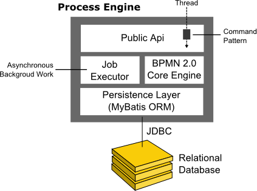
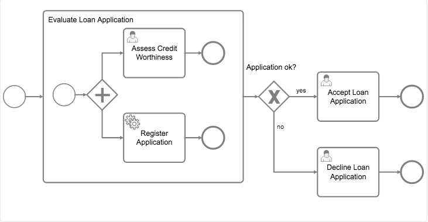
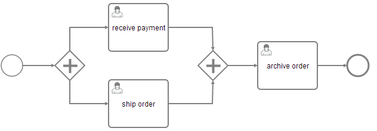
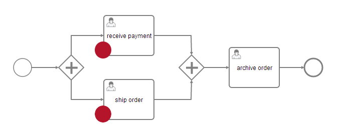
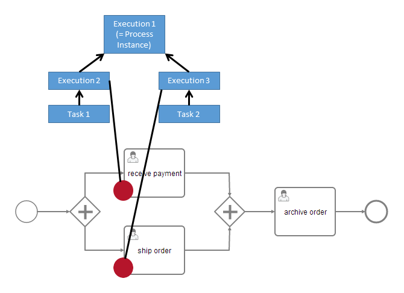
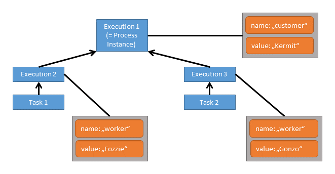
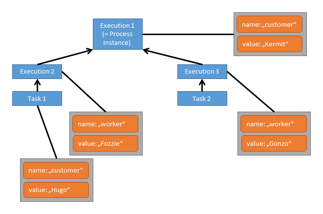
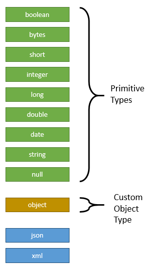

# Camunda Process Engine 流程引擎

## 一.流程引擎的架构



* Process Engine Public API（公共API）：面向服务的API，允许Java应用程序与流程引擎进行交互。流程引擎（即，流程仓库，运行时流程交互，任务管理，...）的不同责任被分为单独的服务。公共API具有命令式访问模式：进入流程引擎的线程通过命令拦截器路由，该拦截器用于设置线程上下文（如事务）。
* BPMN 2.0 Core Enging（核心引擎）：这是流程引擎的核心。它具有用于图形结构的轻量级执行引擎（PVM - Process Virtual Machine），一种将BPMN 2.0 XML文件转换为Java对象的BPMN 2.0解析器和一组BPMN行为实现（为BPMN 2.0构建提供了一些实现，例如网关或服务任务）。
* Job Excutor（任务执行器）：任务执行器负责在进程中处理异步后台工作，如定时器或异步延续。
* The Persistence Layer（持久层）：流程引擎具有一个持久层，负责持久化流程实例状态到关系数据库。我们使用MyBatis映射引擎进行对象关系映射。

## 二.流程引擎依赖以下第三方库：

* MyBatis映射框架 （Apache License 2.0）用于对象关系映射。
* Joda Time （Apache License 2.0）用于解析日期格式。
* Java Uuid Generator（JUG） （Apache License 2.0） Id Generator。请参阅Id-Generators的文档。

附加的可选依赖项：

* Apache Commons Email （Apache License 2.0）用于邮件任务支持。
* Spring框架Spring-Bean （Apache License 2.0）用于配置camunda.cfg.xml。
* 使用camunda.cfg.xml进行配置的Spring Framework Spring-Core （Apache License 2.0）。
* Spring框架Spring-ASM （Apache License 3.0）用于配置camunda.cfg.xml。
* Groovy （Apache许可证2.0）用于groovy脚本任务支持。
* Jython （Python许可证）用于Python脚本任务支持。
* 用于Ruby脚本任务支持的JRuby （Ruby许可证或GPL）。

## 三.Process Engine流程引擎中一些重要的概念

### 1.Process Definition流程定义

流程定义,即定义流程的结构。Camunda BPM使用BPMN 2.0作为其主要建模语言来构建流程定义。

在Camunda BPM中，您可以以BPMN 2.0 XML（这个XML文件可以由Camunda Modeler画好的流程图转换而来）格式将流程部署到流程引擎。解析XML文件并将其转换为流程定义图结构。该图形结构由进程引擎执行。

这里提供一个查询流程定义操作的API供参考：

#### （1）查询流程定义

您可以使用Java API查询所有部署的进程定义，通过该RepositoryService提供的ProcessDefinitionQuery对象来查询。例：

```java
List<ProcessDefinition> processDefinitions = repositoryService.createProcessDefinitionQuery()
    .processDefinitionKey("invoice")
    .orderByProcessDefinitionVersion()
    .asc()
    .list();
```

您还可以使用**REST API**查询流程定义。

#### （2）流程定义中的键和版本

流程定义的key（invoice在上面的示例中）是流程的逻辑标识符。它在整个API中使用，最突出地用于启动流程实例（请参阅流程实例部分）。使用BPMN 2.0 XML文件中id相应<process ... >元素的属性定义流程定义的key：

```xml
<process id="invoice" name="invoice receipt" isExecutable="true">
  ...
</process>
```

如果您使用相同的key部署多个进程，则它们将被处理为进程引擎的相同流程定义的单独版本。

#### （3）挂起/暂停流程定义

暂停进程定义暂时禁用它，即暂停时不能实例化。在RuntimeServiceJava的API可用于挂起一个过程定义。类似地，您可以激活流程定义来撤消此禁用。


### 2.Process Instance 流程实例

流程实例是流程定义的单独执行。流程实例与流程定义的关系与面向对象编程中的对象和类之间的关系相同（演示对象角色的流程实例和在此类比中扮演类角色的流程定义）。

流程引擎负责创建流程实例并管理其状态。如果您启动包含等待状态（例如用户任务）的流程实例，流程引擎必须确保流程实例的状态被捕获并存储在数据库中，直到等待状态为止（用户任务已完成）。

#### （1）启动流程实例

启动流程实例的最简单的方法是使用`RuntimeService`提供的`startProcessInstanceByKey(...)`方法：

```java
ProcessInstance instance = runtimeService.startProcessInstanceByKey("invoice");
```

您可以选择传递几个变量：

```java
Map<String, Object> variables = new HashMap<String,Object>();
variables.put("creditor", "Nice Pizza Inc.");
ProcessInstance instance = runtimeService.startProcessInstanceByKey("invoice", variables);
```

**流程变量可用于流程实例中的所有任务，并在流程实例达到等待状态时自动持久保留到数据库。**

也可以使用**REST API**启动流程实例。

在任何一组活动中启动流程实例

该`startProcessInstanceByKey`和`startProcessInstanceById`方法以默认的初始活动启动流程实例，该活动通常是流程定义的单个空白开始事件。也可以通过使用流程构建器来处理流程实例，从流程实例的任何地方开始。可以通过`RuntimeService`方法访问`createProcessInstanceByKey`和`createProcessInstanceById`来创建流程实例。

以下启动活动'SendInvoiceReceiptTask'和嵌入子流程之前的流程实例'DeliverPizzaSubProcess'：

```java
ProcessInstance instance = runtimeService.createProcessInstanceByKey("invoice")
  .startBeforeActivity("SendInvoiceReceiptTask")
  .setVariable("creditor", "Nice Pizza Inc.")
  .startBeforeActivity("DeliverPizzaSubProcess")
  .setVariableLocal("destination", "12 High Street")
  .execute();
```

流畅的构建器允许提交任何数量的所谓的实例化指令。当调用时execute，进程引擎按照指定的顺序执行这些指令。在上面的例子中，引擎首先启动任务SendInvoiceReceiptTask并执行流程，直到达到等待状态，然后启动DeliverPizzaTask并执行相同操作。在这两个指令之后，execute调用返回。

#### （2）查询流程实例

您可以使用`RuntimeService`提供的`ProcessInstanceQuery`对象来查询当前正在运行的所有流程实例：

```java
runtimeService.createProcessInstanceQuery()
    .processDefinitionKey("invoice")
    .variableValueEquals("creditor", "Nice Pizza Inc.")
    .list();
```    

上面的查询将选择的所有流程实例key为invoice的流程，其中流程变量creditor值为Nice Pizza Inc.。

您还可以使用**REST API**查询流程实例。

#### （3）与流程实例进行交互

对特定流程实例（或流程实例列表）执行查询后，您可能需要与之进行交互。最重要的是与流程实例进行交互有多种可能性：

* 触发它（使其继续执行）：
* 通过消息事件
* 通过信号事件
* 取消它：
* 使用`RuntimeService.deleteProcessInstance(...)`方法。
* 开始/取消任何活动：
* 使用流程实例修改功能

如果您的进程使用至少一个用户任务，您还可以使用`TaskService` API与流程实例进行交互。

#### （4）暂停/挂起流程实例

流程实例的挂起是有帮助的，如果您希望确保它不再执行。例如，如果流程变量处于不期望的状态，则可以挂起实例并安全地更改变量。

详细来说，暂停意味着不允许改变实例的token状态（即当前执行的活动）的所有动作。例如，不可能为挂起的流程实例发出事件或完成用户任务，因为这些操作将会随后继续执行流程实例。然而，仍然允许设置或删除变量的操作，因为它们不会更改token状态。
  
此外，当暂停进程实例时，属于它的所有任务将被暂停。因此，将无法再调用对任务生命周期有影响的操作（即用户分配，任务委托，任务完成，...）。但是，仍然可以允许任何不触及生命周期的操作，如设置变量或添加注释。

可以使用该`suspendProcessInstanceById(...)`方法来暂停流程实例`RuntimeService`。类似地，它可以重新激活。

如果您想暂停给定的流程定义的所有流程实例，可以使用的方法`suspendProcessDefinitionById(...)`的`RepositoryService`，并指定`suspendProcessInstances`选项。

#### （5）流程实例修改

虽然流程模型包含定义必须执行活动的序列流，但有时需要再次灵活启动活动或取消正在运行的活动。

> 例如，当流程模型包含错误（例如错误的序列流条件）以及运行的流程实例需要更正时，这可能很有用。这个API的用例可能是
> * 必须重复或跳过某些步骤的修复流程实例
> * 将流程实例从流程定义的一个版本迁移到另一个版本
> * 测试：可以跳过或重复活动，以对单个流程段进行隔离测试

为了执行这样的操作，流程引擎提供API`RuntimeService.createProcessInstanceModification(...)`修改流程实例。该API允许通过使用构建器在一个调用中指定多个修改说明。特别是有可能是这些情况：

* 在活动之前开始执行
* 在离开活动的序列流上开始执行
* 取消正在运行的活动实例
* 取消给定活动的所有正在运行的实例
* 设置每个指令的变量

> 修改自己本身的流程实例
> 流程实例修改不建议同一实例中！一个活动尝试修改自己的流程实例可能会导致未定义的行为，应该避免这种行为。

> （Cockpit）驾驶舱中的流程实例修改
> Camunda企业版提供了一个用户界面，用于在Camunda Cockpit的BPMN图上可视化地修改流程实例。

**流程实例修改的一个例子**

例如，考虑以下流程模型：



该模型显示了处理贷款申请的简单过程。让我们假设贷款申请已经到位，贷款申请已经被评估，并决定拒绝申请。这意味着流程实例具有以下活动实例状态：

> ProcessInstance  
>   Decline Loan Application

现在，执行拒绝贷款申请任务的工作人员在评估结果中识别错误，并得出结论，应该接受申请。虽然这种灵活性没有被建模为流程的一部分，但流程实例修改允许更正正在运行的流程实例。以下API可以执行这个策略：

```java
ProcessInstance processInstance = runtimeService.createProcessInstanceQuery().singleResult();
runtimeService.createProcessInstanceModification(processInstance.getId())
  .startBeforeActivity("acceptLoanApplication")
  .cancelAllForActivity("declineLoanApplication")
  .execute();
```

该命令首先在活动Accept Loan Application之前开始执行，直到达到等待状态（在这种情况下创建用户任务）。之后，它取消拒绝贷款申请活动的运行实例。在工作任务列表中，“ 拒绝”任务已被删除，并显示“ 接受”任务。生成的活动实例状态是：


> ProcessInstance  
>   Accept Loan Application

我们假设在批准贷款申请时，存在一个名为‘Approver’的变量。这可以通过扩展的修改请求来实现，如下所示：

```java
ProcessInstance processInstance = runtimeService.createProcessInstanceQuery().singleResult();
runtimeService.createProcessInstanceModification(processInstance.getId())
  .startBeforeActivity("acceptLoanApplication")
  .setVariable("approver", "joe")
  .cancelAllForActivity("declineLoanApplication")
  .execute();
```

添加的`setVariable`的调用确保在开始活动之前，提交指定的变量。

现在到一些更复杂的情况。说申请再次遭到拒绝，拒绝贷款申请活动处于激活状态。现在，工作人员认识到评估过程是错误的，想要完全重新启动。以下这些操作可以表示执行此任务的修改请求，即完全重新启动：

可以启动子流程活动：

```java
ProcessInstance processInstance = runtimeService.createProcessInstanceQuery().singleResult();
runtimeService.createProcessInstanceModification(processInstance.getId())
  .cancelAllForActivity("declineLoanApplication")
  .startBeforeActivity("assessCreditWorthiness")
  .startBeforeActivity("registerApplication")
  .execute();
```

从子流程的开始事件开始：

```java
ProcessInstance processInstance = runtimeService.createProcessInstanceQuery().singleResult();
runtimeService.createProcessInstanceModification(processInstance.getId())
  .cancelAllForActivity("declineLoanApplication")
  .startBeforeActivity("subProcessStartEvent")
  .execute();
```

启动子流程本身：

```java
ProcessInstance processInstance = runtimeService.createProcessInstanceQuery().singleResult();
runtimeService.createProcessInstanceModification(processInstance.getId())
  .cancelAllForActivity("declineLoanApplication")
  .startBeforeActivity("evaluateLoanApplication")
  .execute();
```

启动流程的启动事件：

```java
ProcessInstance processInstance = runtimeService.createProcessInstanceQuery().singleResult();
runtimeService.createProcessInstanceModification(processInstance.getId())
  .cancelAllForActivity("declineLoanApplication")
  .startBeforeActivity("processStartEvent")
  .execute();
```

### 3.Process Excution 流程执行

如果您的流程实例包含多个执行路径（例如在并行网关之后），则必须能够区分进程实例中的当前活动路径。在以下示例中，两个用户任务接收付款，并且同时发送订单可以处于活动状态。



在内部，流程引擎在流程实例中创建两个并发执行，每个并发执行一个路径。还为范围性的流程创建执行对象，例如，如果进程引擎到达嵌入式子进程，或者在多实例的情况下。

执行是分层的，流程实例中的所有执行都跨越树，流程实例是树中的根节点。注意：流程实例本身是一个执行。执行是范围是可变的，意味着动态数据可以与它们相关联。

#### 查询流程执行对象

您可以使用`RuntimeService`提供的`ExecutionQuery`对象来查询流程执行对象：

```java
runtimeService.createExecutionQuery()
    .processInstanceId(someId)
    .list();
```

上述查询返回指定流程实例的所有执行对象。您还可以使用**REST API**查询执行。


### 4.Activiti Instance 活动实例

活动实例概念与执行实例概念相似，但采用不同的观点。虽然执行实例可以被想象为通过流程的token，但活动实例表示活动（任务，子流程，...）的单个实例。因此，活动实例的概念更加以状态为导向。

活动实例也跨越一个树，遵循BPMN 2.0提供的范围结构。“同一级别的子流程”（即同一范围的一部分包含在同一子流程中）的活动将使其活动实例位于同一级别的树中。

例子：

* 在并行网关之后使用两个并行用户任务的流程：在活动实例树中，您将看到根实例下面的两个活动实例，每个用户任务一个。
* 在并行网关之后使用两个并行多实例用户任务的流程：在活动实例树中，两个用户任务的所有实例将在根活动实例下列出。原因：所有活动实例都处于同一级别的子流程。
* 嵌入式子流程中的用户任务：活动实例树将具有3个级别：表示流程实例本身的根实例，再下面是表示嵌入式子流程实例的活动实例，最下面是表示用户任务的活动实例。

**（1）检索活动实例**

当前活动实例只能检索流程实例：

```java
ActivityInstance rootActivityInstance = runtimeService.getActivityInstance(processInstance.getProcessInstanceId());
```

您也可以使用**REST API**检索活动实例树。

**（2）身份和唯一性**

每个活动实例都被分配一个唯一的ID。ID是持久的，如果您多次调用此方法，将为相同的活动实例返回相同的活动实例ID。（但是，可能会分配不同的执行，见下文）

**（3）与执行的关系**

流程引擎中的执行概念与活动实例概念不完全一致，因为执行树通常与BPMN中的活动/范围概念不一致。一般来说，**Execution和ActivityInstances之间存在n-1关系**，即在给定的时间点，活动实例可以链接到多个执行。此外，不能保证启动指定活动实例的执行实例也会结束这个活动实例。流程引擎关于执行树的压缩会执行几个内部优化，这可能导致执行被重新排序和缩减。这可能导致一个执行实例用来启动指定活动实例而另一个执行实例执行结束的情况。

另一个特殊情况是流程实例：  
注意：如果您需要根据BPMN流程模型解释流程实例的状态，通常相比使用执行树而言，使用活动实例树会更容易。


### 5.Job And Job Definition 任务和任务定义

Camunda流程引擎包括一个名为Job Executor的组件。**任务执行器是调度组件，负责执行异步后台工作。**

考虑一个定时器事件的例子：每当流程引擎到达定时器事件时，它将停止执行，将当前状态保存到数据库，并创建一个任务以便将来恢复执行。任务具有使用BPMN XML中提供的定时器表达式计算的到期日期。

**当部署流程时，流程引擎为流程中的每个活动创建一个任务定义，该活动将在运行时创建任务。**这允许您查询有关流程中的定时器和异步延时的信息。

**（1）查询任务**

使用管理服务，您可以查询任务。以下选择在特定日期之后到期的所有任务：

```java
managementService.createJobQuery()
  .duedateHigherThan(someDate)
  .list()
```

可以使用**REST API**查询作业。

**（2）查询任务定义**

使用管理服务，您还可以查询任务定义。以下从指定流程定义中查询所有任务定义：

```java
managementService.createJobDefinitionQuery()
  .processDefinitionKey("orderProcess")
  .list()
```

结果将包含有关流程定义key为‘orderProcess’中所有定时器和异步延时的信息。

还可以使用**REST API**查询任务定义。

**（3）暂停/挂起和激活任务执行**

任务挂起防止任务被执行。挂起执行任务可以在不同层次上进行控制：

* 任务实例级别：`managementService.suspendJob(...)`在挂起流程实例或任务定义时，可以直接通过API挂起或临时挂起个别任务。
* 任务定义级别：某个定时器或活动的所有实例都可以挂起。

按任务定义级别的挂起任务允许您挂起某个定时器或异步延时的所有实例。直观地，这允许您以一种所有流程实例将前进的方式在流程中挂起某个活动，直到流程达到此活动，然后活动被挂起后才能继续。

我们假设有一个使用key值为'orderProcess'部署的流程，其中包含一个名为'processPayment'的服务任务。服务任务具有异步延时的配置，使这个服务任务由任务执行器来执行。以下示例显示如何防止'processPayment'服务被执行：

```java
List<JobDefinition> jobDefinitions = managementService.createJobDefinitionQuery()
        .processDefinitionKey("orderProcess")
        .activityIdIn("processPayment")
        .list();

for (JobDefinition jobDefinition : jobDefinitions) {
  managementService.suspendJobDefinitionById(jobDefinition.getId(), true);
}
```

### 6. Process Variables 流程变量

本节介绍流程中变量的概念。变量可用来在变量范围或者流程运行时添加数据。提供许多的API允许更新所属的变量来改变这些实体的状态。一般来说，变量由名称和值组成。该名称用于跨流程结构的标识。例如，如果一个活动设置名为var的变量，后续活动可以使用此名称访问它。变量的值是一个Java对象。

#### (1)变量范围和变量可见性   

具有变量的所有实体都称为变量范围。这些实体是执行（包括流程实例）和任务。流程实例的运行时状态由执行树表示。观察以下流程模型，红色点标记激活的任务：



此流程的运行时结构如下：



有一个具有两个子执行对象的流程实例，每个执行对象都创建了一个任务。所有这五个实体是变量范围，箭头标记父子关系。在父范围中定义的变量可在每个子范围内访问，除非子范围定义了相同名称的变量。另外，父范围中无法访问子范围变量。直接附加到相关范围的变量称为局部变量。观察以下赋值范围的变量：



在这种情况下，当处理‘Task1’时，可以访问变量‘worker’和‘customer’。注意，由于范围的结构，可以将变量‘worker’定义两次，以便‘Task1’访问与‘Task2’不同的‘worker’变量。但是，两者共享这个变量的用户，这意味着如果该变量被其中一个任务更新，则此次更改对于另一个也是可见的。

这两个Task可以访问两个变量，而这些变量都不是局部变量。所有的三个Excution都有一个局部变量。
现在我们假设我们在‘Task 1’上设置一个局部变量：



虽然可以从‘Task1’访问两个名为‘customer’和‘worker’的变量，但‘Excution1’中的Customer Variable（自定义变量）是隐藏的，因此可访问的Customer Variable（自定义变量）是‘任务1’的局部变量。

**总结**：
> 1. 变量由名称和值组成
> 2. 变量可用来在变量范围或者流程运行时添加数据。
> 3. 子范围在父范围中定义的变量，除非子范围定义了相同名称的变量。
> 4. 父范围中无法访问子范围变量。
> 5. 父范围中可访问的Customer Variable（自定义变量）是子范围中附加活动的局部变量。

#### （2）什么时候可以访问变量？
一般来说，在以下情况下可以访问变量：
* 实例化流程
* 发送消息
* 任务生命周期过渡，如完成或解决
* 从外部设置/获取变量
* 在代理中设置/获取变量
* 流程模型中的表达式
* 流程模型中的脚本
* （历史）变量查询

#### （3）设置和检索变量

要设置和检索变量，流程引擎提供了一个Java API，允许从Java对象中设置变量并以相同的形式检索变量。

在内部，引擎将变量保留到数据库，因此会应用到序列化。对于大多数应用程序，这是一个不关心的细节。然而，有时候，当使用自定义Java类时，变量的序列化值是有意义的。想象一下这样一个情况，一个监控应用程序管理着许多流程应用程序。它与这些应用程序的类脱离了，因此无法在其Java表示中访问自定义变量。对于这些情况，流程引擎提供了检索和操作序列化值的方法。这归结为两个API：
* Java Object Value API：变量值为Java对象。这些对象可以直接设置为值并以相同的形式检索。这是更简单的API，并且是在将代码实现为流程应用程序的一部分时推荐使用的方法。
* Typed Value API：变量值包含在用于设置和检索变量的所谓键入值中。键入值提供对元数据的访问，例如可以根据引擎序列化变量的方式，根据变量类型类型，变量的序列化表示来访问元数据（描述数据的数据）。

我们我看下使用两个API检索并设置两个整数变量的代码示例：

```java
// Java Object API: Get Variable
Integer val1 = (Integer) execution.getVariable("val1");

// Typed Value API: Get Variable
IntegerValue typedVal2 = execution.getVariableTyped("val2");
Integer val2 = typedVal2.getValue();

Integer diff = val1 - val2;

// Java Object API: Set Variable
execution.setVariable("diff", diff);

// Typed Value API: Set Variable
IntegerValue typedDiff = Variables.integerValue(diff);
execution.setVariable("diff", typedDiff);
```

该代码的具体细节将在Java对象值API和键入值API的部分中有更详细的描述。

#### （4）支持的变量值
流程引擎支持以下变量值类型：



根据变量的实际值，分配不同的类型。在可用类型中，有九种基本值类型，它们对应的标准的JDK类：
* boolean：实例 java.lang.Boolean
* bytes：实例 byte[]
* short：实例 java.lang.Short
* integer：实例 java.lang.Integer
* long：实例 java.lang.Long
* double：实例 java.lang.Double
* date：实例 java.util.Date
* string：实例 java.lang.String
* null：null References

此外，值类型object表示自定义Java对象。当这样一个变量被持久化时，它的值是按序列化过程进行序列化的。这些程序是可配置和可交换的。

如果您希望以XML或JSON格式存储变量，则可以使用类型`xml`或`json`。两者都是特殊的，因为引擎在枚举中为它们提供常量，`SerializationDataFormats`但不提供任何开箱即用串行器。可以`TypedValueSerializers`为这些类型编写自己的文件，并在流程引擎配置中注册它们，也可以使用`camunda Spin`，它可以为两种类型提供支持（[参见此处]()）。

#### （5）两个API（Java Object Value API、Typed Value API）

**①Java Object Value API Java对象值API**

使用Java的流程变量最方便的方法是使用它们的Java对象表示。无论流程引擎提供变量访问，流程变量都可以在此表示中被访问，因为对于自定义对象，引擎知道所涉及的类。例如，以下代码设置并检索给定流程实例的变量：

```java
com.example.Order order = new com.example.Order();
runtimeService.setVariable(execution.getId(), "order", order);
com.example.Order retrievedOrder = (com.example.Order) runtimeService.getVariable(execution.getId(), "order");
```

请注意，此代码在变量范围的层次结构中的最高的可能的点设置变量。这意味着，如果变量已经存在（无论是在此执行还是其父范围中），都会被更新。如果变量尚未存在，则创建的范围最大，即流程实例。如果一个变量应该被准确地设置在提供的执行对象上，那么可以使用本地方法。例如：

```java
com.example.Order order = new com.example.Order();
runtimeService.setVariableLocal(execution.getId(), "order", order);

com.example.Order retrievedOrder = (com.example.Order) runtimeService.getVariable(execution.getId(), "order");
com.example.Order retrievedOrder = (com.example.Order) runtimeService.getVariableLocal(execution.getId(), "order");
// both methods return the variable
```

每当在其Java表示中设置变量时，如果提供的值不能被序列化，则流程引擎自动确定适当的值序列化程序或引发异常。


**②Typed Value API 键入值API**.

在重要的情况下，访问变量的序列化表示或引擎必须提示以某种格式序列化值时，可以使用基于键入值的API。与基于Java对象的API相比，它将一个变量值包装在所谓的“ 键入值”中。这种键入的值允许更丰富的变量值的表示。

为了轻松构建键入值，Camunda BPM提供类`org.camunda.bpm.engine.variable.Variables`。该类包含允许创建单一类型值的静态方法，以及创建类型值的映射。

1.变量初始值

以下代码通过将其指定为键入值来设置单个String变量：

```java
StringValue typedStringValue = Variables.stringValue("a string value");
runtimeService.setVariable(execution.getId(), "stringVariable", typedStringValue);

StringValue retrievedTypedStringValue = runtimeService.getVariableTyped(execution.getId(), "order");
String stringValue = retrievedTypedStringValue.getValue(); // equals "a string value"
```

请注意，使用该API，变量值附近还有一个级别的抽象。因此，为了访问真实值，需要解开实际值。

2.对象值

当然，对于简单的String值，基于Java对象的API更简洁。因此，让我们考虑一个具有自定义对象值的示例：

```java
com.example.Order order = new com.example.Order();
ObjectValue typedObjectValue = Variables.objectValue(order).create();
runtimeService.setVariableLocal(execution.getId(), "order", typedObjectValue);

ObjectValue retrievedTypedObjectValue = runtimeService.getVariableTyped(execution.getId(), "order");
com.example.Order retrievedOrder = (com.example.Order) retrievedTypedObjectValue.getValue();
```

这又等同于基于Java对象的API。然而，现在可以告诉引擎持久化该值时使用哪种序列化格式。例如，`ObjectValue typedObjectValue = Variables.objectValue(order).serializationDataFormat(Variables.SerializationDataFormats.JAVA).create();`创建一个由引擎的内置Java对象序列化程序序列化的值。此外，检索的ObjectValue实例还提供了其他变量详细信息：

```java
// returns true
boolean isDeserialized = retrievedTypedObjectValue.isDeserialized();

// returns the format used by the engine to serialize the value into the database
String serializationDataFormat = retrievedTypedObjectValue.getSerializationDateFormat();

// returns the serialized representation of the variable; the actual value depends on the serialization format used
String serializedValue = retrievedTypedObjectValue.getValueSerialized();

// returns the class com.example.Order
Class<com.example.Order> valueClass = retrievedTypedObjectValue.getObjectType();

// returns the String "com.example.Order"
String valueClassName = retrievedTypedObjectValue.getObjectTypeName();
```

当调用应用程序不具有实际变量值的类（即`com.example.Order` is not known）时，序列化细节很有用。在这些情况下，`runtimeService.getVariableTyped(execution.getId(), "order")`会引发异常，因为它会立即尝试反序列化变量值。在这种情况下，`runtimeService.getVariableTyped(execution.getId(), "order", false)`可以使用调用。额外的布尔参数告诉进程引擎不要尝试反序列化。在这种情况下，调用`isDeserialized()`将返回`false`并调用`getValue()，getObjectType()`将引发异常。调用`getValueSerialized()`并且`getObjectTypeName()`是访问变量的一种方式。

类似地，可以从其序列化表示中设置变量：

```java
String serializedOrder = "...";
ObjectValue serializedValue =
  Variables
    .serializedObjectValue(serializedOrder)
    .serializationDataFormat(Variables.SerializationDataFormats.JAVA)
    .objectTypeName("com.example.Order")
    .create();

runtimeService.setVariableLocal(execution.getId(), "order", serializedValue);

ObjectValue retrievedTypedObjectValue = runtimeService.getVariableTyped(execution.getId(), "order");
com.example.Order retrievedOrder = (com.example.Order) retrievedTypedObjectValue.getValue();
```

> 意识到不一致的变量状态：  
当设置序列化变量值时，不会检查序列化值的结构是否与变量值应该是一个实例的类兼容。当从上面的示例中设置变量时，提供的序列化值不会对`com.example.Order`其结构进行验证。因此，只有当`runtimeService#getVariableTyped`被调用时才会检测到无效的变量值。

3.设置多个类型值

类似于基于Java对象的API，还可以在一个API调用中设置多个类型值。该Variables级提供了API来构建Map类型的值：

```java
com.example.Order order = new com.example.Order();

VariableMap variables =
  Variables.create()
    .putValueTyped("order", Variables.objectValue(order))
    .putValueTyped("string", Variables.stringValue("a string value"));
runtimeService.setVariablesLocal(execution.getId(), "order", variables);
```

**③API的互换性**

这两个API在相同的实体上提供不同的视图，因此可以根据需要进行组合。例如，可以使用基于Java-Object的API设置的变量作为类型值检索，反之亦然。当类VariableMap实现Map接口时，也可以将简单的Java对象以及类型的值放入该映射。

应该使用哪个API？最符合你目的的。当您确定您始终可以访问所涉及的值类时，例如在像流程应用程序中实现代码时JavaDelegate，则基于Java对象的API更易于使用。当您需要访问特定于值的元数据（如序列化格式）时，基于类型值的API就是要走的路。


#### （5）对象值的序列化

当一个object值传递给流程引擎时，可以指定序列化格式来告诉流程引擎以特定格式存储该值。基于这种格式，引擎查找一个串行器。串行器能够将Java对象序列化为指定的格式，并从该格式的表示中将其反序列化。这意味着，可能会有不同格式的不同序列化程序，并且可以实现自定义序列化程序，以便以特定格式存储自定义对象。

流程引擎为格式提供一个内置的对象序列化程序`application/x-java-serialized-object`。它能够串行化实现接口的Java对象，`java.io.Serializable`并应用标准的Java对象序列化。

当使用Typed Value API设置变量时，可以指定所需的序列化格式：

```java
CustomerData customerData = new CustomerData();

ObjectValue customerDataValue = Variables.objectValue(customerData)
  .serializationDataFormat(Variables.SerializationDataFormats.JAVA)
  .create();

execution.setVariable("someVariable", customerDataValue);
```

除此之外，进程引擎配置还有一个选项`defaultSerializationFormat`，当不请求特定的格式时使用该选项。此选项默认为`application/x-java-serialized-object`。

> **在Task Froms（任务表单）中使用自定义对象**：    
> 请注意，内置的串行器将对象转换为字节流，只能用当前的Java类进行解释。当实现基于复杂对象的任务表单时，应该使用基于文> 本的序列化格式，因为任务列表不能解释这些字节流。有关如何集成序列化格式（如XML和JSON）的详细信息，请参阅将对象序列> 化为XML和JSON。  
> **将对象序列化为XML和JSON**：  
> camunda Spin Plugin 提供了能够序列化对象值到XML和JSON的序列化器。当希望序列化对象值可以人为解释时，或者当序列化值应该是有意义的而没有相应的Java类时，可以使用它们。  
> 使用预制的camunda发行版时，camunda Spin已经预配置，您可以尝试这些格式，无需进一步配置。

#### （6）输入/输出变量映射

为了提高源代码和业务逻辑的可重用性，camunda BPM提供过程变量的input / output映射。这可以用于任务，事件和子进程。

为了使用变量映射，必须将camunda扩展元素`inputOutput`添加到元素中。它可以包含多个`inputParameter`和`outputParameter`元素，用于指定哪些变量应该映射。`inputParameter`的`name`属性表示活动中的变量名称（要创建的局部变量），而`outputParameter`的`name`属性表示活动外的变量名称。

`input / outputParameter`的内容指定映射到相应变量的值。它可以是一个简单的常量字符串或表达式。一个空的将变量设置为该值null。

```xml
<camunda:inputOutput>
  <camunda:inputParameter name="x">foo</camunda:inputParameter>
  <camunda:inputParameter name="willBeNull"/>
  <camunda:outputParameter name="y">${x}</camunda:outputParameter>
  <camunda:outputParameter name="z">${willBeNull == null}</camunda:outputParameter>
</camunda:inputOutput>
```

甚至可以使用list列表和map等复杂的结构。两者也可以嵌套。

```xml
<camunda:inputOutput>
  <camunda:inputParameter name="x">
    <camunda:list>
      <camunda:value>a</camunda:value>
      <camunda:value>${1 + 1}</camunda:value>
      <camunda:list>
        <camunda:value>1</camunda:value>
        <camunda:value>2</camunda:value>
        <camunda:value>3</camunda:value>
      </camunda:list>
    </camunda:list>
  </camunda:inputParameter>
  <camunda:outputParameter name="y">
    <camunda:map>
      <camunda:entry key="foo">bar</camunda:entry>
      <camunda:entry key="map">
        <camunda:map>
          <camunda:entry key="hello">world</camunda:entry>
          <camunda:entry key="camunda">bpm</camunda:entry>
        </camunda:map>
      </camunda:entry>
    </camunda:map>
  </camunda:outputParameter>
</camunda:inputOutput>
```

也可以使用脚本来提供变量值。请参阅脚脚本部分，了解如何指定脚本。

体现input / output映射好处的一个简单示例是：一个复杂的计算，它应该是多例流程定义的一部分。该计算可以作为孤立的委托代码或脚本开发，并在每个流程中重复使用，即使流程使用不同的变量集。输入映射用于将不同的流程变量映射到复杂计算活动的所需输入的参数。因此，输出映射允许在进一步的处理执行中利用计算结果。

更详细地说，让我们假设这样一个计算是由Java代理类实现的`org.camunda.bpm.example.ComplexCalculation`。该代理类需要一个`userId`和一个`costSum`变量作为输入参数。然后计算三个值`pessimisticForecast`，`realisticForecast`和`optimisticForecast`，这些值描述预测的未来客户将要面临的开销。

在第一个流程中，两个输入变量都可用作流程变量，但具有不同的名称（id，sum）。从三个结果来看，该流程只使用`realisticForecast`依赖于名称为`forecast`的后续活动。相应的input / output映射如下所示：

```xml
<serviceTask camunda:class="org.camunda.bpm.example.ComplexCalculation">
  <extensionElements>
    <camunda:inputOutput>
      <camunda:inputParameter name="userId">${id}</camunda:inputParameter>
      <camunda:inputParameter name="costSum">${sum}</camunda:inputParameter>
      <camunda:outputParameter name="forecast">${realisticForecast}</camunda:outputParameter>
    </camunda:inputOutput>
  </extensionElements>
</serviceTask>
```

在第二个流程中，让我们假设`costSum`变量必须从三个不同的Map的属性来计算。此外，该流程取决于名称为`avgForecast`的三个预测变量的平均值。在这种情况下，映射如下所示：

```xml
<serviceTask camunda:class="org.camunda.bpm.example.ComplexCalculation">
  <extensionElements>
    <camunda:inputOutput>
      <camunda:inputParameter name="userId">${id}</camunda:inputParameter>
      <camunda:inputParameter name="costSum">
        ${mapA[costs] + mapB[costs] + mapC[costs]}
      </camunda:inputParameter>
      <camunda:outputParameter name="avgForecast">
        ${(pessimisticForecast + realisticForecast + optimisticForecast) / 3}
      </camunda:outputParameter>
    </camunda:inputOutput>
  </extensionElements>
</serviceTask>
```

多实例IO映射:

输入映射也可以与多实例结构一起使用，其中映射应用于创建的每个实例。例如，对于具有五个实例的多实例流程，执行映射五次，并且在五个子流程范围中的每一个中创建所涉及的变量，以便可以独立访问。  
没有多实例结构的输出映射：  
引擎不支持多实例构造的输出映射。输出映射的每个实例将覆盖由先前实例设置的变量，并且最终变量状态将变得难以预测。


## 4.Process Engine流程引擎配置

### (1)Process Engine配置选项

有多个选项来配置和创建流程引擎，具体取决于使用的是应用程序托管的流程引擎还是共享的，容器管理的进程引擎。

**①应用程序管理过程引擎：**

您将流程引擎作为应用程序的一部分进行管理。以下方式可以进行配置：

* 以编程方式通过Java API
* 通过XML配置
* 使用Spring配置

**②共享的容器管理过程引擎：**

您选择的容器（例如，Tomcat，JBoss，GlassFish或IBM WebSphere）为您管理流程引擎。配置以容器特定的方式执行，有关详细信息，请参阅运行时容器集成。

### (2)ProcessEngineConfiguration Bean流程引擎配置类

camunda引擎使用ProcessEngineConfiguration bean来配置和构建独立的Process Engine。可以使用多个可用的子类来定义流程引擎配置。这些类代表不同的环境，并相应地设置默认值。选择与您的环境匹配（大部分）的类以最小化配置引擎所需的属性数量是最佳做法。以下目前可用的类：

* `org.camunda.bpm.engine.impl.cfg.StandaloneProcessEngineConfiguration`流程引擎以独立的方式使用。引擎本身将处理事务。默认情况下，只有引擎启动时才会检查数据库（如果没有数据库模式或模式版本不正确，则抛出异常）。
* `org.camunda.bpm.engine.impl.cfg.StandaloneInMemProcessEngineConfiguration`这是用于单元测试目的的便利类。引擎本身将处理事务。默认使用H2内置数据库。当引擎启动并关闭时，数据库将被创建和删除。当使用这个时，可能不需要额外的配置（例如，使用任务执行器或邮件功能时除外）。
* `org.camunda.bpm.engine.spring.SpringProcessEngineConfiguration`在Spring环境中使用进程引擎时使用。有关更多信息，请参阅Spring集成部分。
* `org.camunda.bpm.engine.impl.cfg.JtaProcessEngineConfiguration` 当引擎以独立模式运行时，使用JTA事务。

### 应用程序管理中配置流程引擎三种不同的方式

**①使用Java API启动流程引擎**

您可以通过创建正确的ProcessEngineConfiguration对象或使用某些预定义对象来以编程方式配置流程引擎：

```java
ProcessEngineConfiguration.createStandaloneProcessEngineConfiguration();
ProcessEngineConfiguration.createStandaloneInMemProcessEngineConfiguration();
```

现在您可以调用该buildProcessEngine()操作来创建流程引擎：

```java
ProcessEngine processEngine = ProcessEngineConfiguration.createStandaloneInMemProcessEngineConfiguration()
  .setDatabaseSchemaUpdate(ProcessEngineConfiguration.DB_SCHEMA_UPDATE_FALSE)
  .setJdbcUrl("jdbc:h2:mem:my-own-db;DB_CLOSE_DELAY=1000")
  .setJobExecutorActivate("true")
  .buildProcessEngine();
```

**②在xml中配置流程引擎**

*1.在bpm-platform.xml中配置流程引擎*

该bpm-platform.xml文件用于在以下发行版中配置camunda BPM平台：

* Apache Tomcat
* GlassFish Application Server
* IBM WebSphere Application Server
* Oracle WebLogic Application Server

该`<process-engine ... />`XML标签允许你定义一个流程引擎：

```xml
<?xml version="1.0" encoding="UTF-8"?>
<bpm-platform xmlns="http://www.camunda.org/schema/1.0/BpmPlatform"
              xmlns:xsi="http://www.w3.org/2001/XMLSchema-instance"
              xsi:schemaLocation="http://www.camunda.org/schema/1.0/BpmPlatform http://www.camunda.org/schema/1.0/BpmPlatform">

  <job-executor>
    <job-acquisition name="default" />
  </job-executor>

  <process-engine name="default">
    <job-acquisition>default</job-acquisition>
    <configuration>org.camunda.bpm.engine.impl.cfg.StandaloneProcessEngineConfiguration</configuration>
    <datasource>java:jdbc/ProcessEngine</datasource>

    <properties>
      <property name="history">full</property>
      <property name="databaseSchemaUpdate">true</property>
      <property name="authorizationEnabled">true</property>
    </properties>

  </process-engine>
</bpm-platform>
```

有关文件语法的完整文档，请参阅部署描述符参考bpm-platform.xml。

*2.在processes.xml中配置流程引擎*

流程引擎也可以使用该META-INF/processes.xml文件进行配置和引导。有关详细信息，请参阅processes.xml文件。

有关文件语法的完整文档，请参阅部署描述符参考processes.xml。


**③使用Spring XML配置流程引擎**

配置流程引擎的最简单方法是通过一个名为的XML文件camunda.cfg.xml。使用它可以简单地做：

```java
ProcessEngine processEngine = ProcessEngines.getDefaultProcessEngine()
```

在camunda.cfg.xml必须包含有ID的豆processEngineConfiguration，选择最适合的ProcessEngineConfiguration班级相适应您的需求：

```xml
<bean id="processEngineConfiguration" class="org.camunda.bpm.engine.impl.cfg.StandaloneProcessEngineConfiguration">
```

这将camunda.cfg.xml在类路径上查找文件，并根据该文件中的配置构建引擎。以下代码段显示了一个示例配置：

```xml
<beans xmlns="http://www.springframework.org/schema/beans"
       xmlns:xsi="http://www.w3.org/2001/XMLSchema-instance"
       xsi:schemaLocation="http://www.springframework.org/schema/beans http://www.springframework.org/schema/beans/spring-beans.xsd">

  <bean id="processEngineConfiguration" class="org.camunda.bpm.engine.impl.cfg.StandaloneProcessEngineConfiguration">

    <property name="jdbcUrl" value="jdbc:h2:mem:camunda;DB_CLOSE_DELAY=1000" />
    <property name="jdbcDriver" value="org.h2.Driver" />
    <property name="jdbcUsername" value="sa" />
    <property name="jdbcPassword" value="" />

    <property name="databaseSchemaUpdate" value="true" />

    <property name="jobExecutorActivate" value="false" />

    <property name="mailServerHost" value="mail.my-corp.com" />
    <property name="mailServerPort" value="5025" />
  </bean>

</beans>
```

请注意，配置XML实际上是一个Spring配置。这并不意味着只能在Spring环境中使用camunda引擎！我们只是简单地利用Spring内部的解析和依赖注入功能来构建引擎。  

ProcessEngineConfiguration对象也可以使用配置文件以编程方式创建。也可以使用不同的bean ID：

```java
ProcessEngineConfiguration.createProcessEngineConfigurationFromResourceDefault();
ProcessEngineConfiguration.createProcessEngineConfigurationFromResource(String resource);
ProcessEngineConfiguration.createProcessEngineConfigurationFromResource(String resource, String beanName);
ProcessEngineConfiguration.createProcessEngineConfigurationFromInputStream(InputStream inputStream);
ProcessEngineConfiguration.createProcessEngineConfigurationFromInputStream(InputStream inputStream, String beanName);
```

也可以不使用配置文件并根据默认值创建配置（有关详细信息，请参阅不同的支持类）。

```java
ProcessEngineConfiguration.createStandaloneProcessEngineConfiguration();
ProcessEngineConfiguration.createStandaloneInMemProcessEngineConfiguration();
```

所有这些ProcessEngineConfiguration.createXXX()方法返回ProcessEngineConfiguration，如果需要可以进一步调整。调用buildProcessEngine()操作后，ProcessEngine如上所述创建。