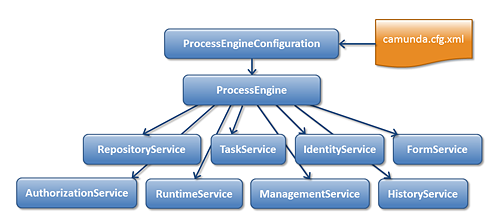

# API
Javadoc：有关服务操作和引擎API的更多详细信息，请参阅：http://docs.camunda.org/javadoc/camunda-bpm-platform/7.3/

REST API：https://docs.camunda.org/manual/7.3/api-references/rest/#overview


## 一、流程引擎API


Java API是与引擎交互的最常见方式。中心起点是ProcessEngine，它可以通过配置部分所述的几种方式创建。从ProcessEngine可以获得包含工作流/ BPM方法的各种服务。ProcessEngine和服务对象是线程安全的。所以你可以保留一个对整个服务器的引用。



Service API 服务API

```java
ProcessEngine processEngine = ProcessEngines.getDefaultProcessEngine();

RuntimeService runtimeService = processEngine.getRuntimeService();

RepositoryService repositoryService = processEngine.getRepositoryService();

TaskService taskService = processEngine.getTaskService();

ManagementService managementService = processEngine.getManagementService();

IdentityService identityService = processEngine.getIdentityService();

HistoryService historyService = processEngine.getHistoryService();

FormService formService = processEngine.getFormService();

```

### 1.ProcessEngines

`ProcessEngines.getDefaultProcessEngine()`首次初始化并创建引擎，之后总是返回相同的流程引擎。

`ProcessEngines.init()`和`ProcessEngines.destroy()`所有流程引擎的创建和关闭。

创建流程引擎时`ProcessEngines`类将扫描所有`camunda.cfg.xml`和`activiti.cfg.xml`文件。


对于所有camunda.cfg.xml文件，流程引擎创建方式：

```java
ProcessEngineConfiguration.createProcessEngineConfigurationFromInputStream(inputStream).buildProcessEngine()。
```

对于所有activiti.cfg.xml文件，流程引擎将以Spring的方式构建：首先创建Spring应用程序上下文，然后从该应用程序上下文获取流程引擎。

### 2.Service API

所有Service都是无国籍的。这意味着您可以轻松地在集群中的多个节点上运行Camunda BPM，每个节点都进入同一个数据库，而无需担心哪个计算机实际执行以前的调用。不管在哪里执行，任何对任何服务的调用都是幂等的。

#### （1）RepositoryService

RepositoryService是Camunda 引擎工作时所需要的第一个服务。该服务提供了管理和部署流程定义的操作。RepositoryService是关于静态信息（即数据不会更改，或至少不是很多）。

> **部署**：  

> 1. 部署是引擎包装流程的单位。一个部署可以包含多个BPMN 2.0 xml文件和其他任何资源。  
> 2. 一个部署中包含的内容的选择取决于开发人员。它可以从单个流程的BPMN 2.0 xml文件到和整个流程相关资源包（例如，部署“hr-process”可以包含与“hr process”相关的所有内容）。
> 3. 部署意味着将其上传到引擎，在引擎中检查和解析所有流程，然后再存储在数据库中。从那时起，系统就知道已部署的流程，就可以启动部署中包含的任何流程。

RepositoryService可以：

* 查询引擎已知的部署和流程定义。
* 挂起并激活流程定义。挂起的意思是没有进一步的操作，而激活则相反。
* 检索由引擎自动生成的各种资源，如部署或流程图中包含的文件。

#### （2）RuntimeService

1. RuntimeService处理由流程定义启动的新的流程实例。流程定义定义了流程中不同步骤的结构和行为。流程实例是这种流程定义的一个执行。对于每个流程定义，通常有许多流程实例同时运行。

2. RuntimeService用于检索和存储流程变量（特值于指定流程实例的数据，例如，排它网关通常使用流程变量来确定选择哪个路径来继续执行流程）。

3. RuntimeService查询流程实例和执行。

> **Excution执行**  
> BPMN 2.0的“token”概念的表示。基本上执行是指向当前流程实例的位置的指针。

4. 当流程实例等待外部触发器并且需要流程往下继续时，将使用RuntimeService。流程实例可以具有各种等待状态，并且该service包含各种操作以“发送”被外部触发器接收的实例，并且可以使流程实例继续下去。

#### （3）TaskService

与任务相关的都在TaskService中，需要由系统的实际人员执行的任务是流程引擎的核心。

* 查询分配给用户或组的任务。
* 创建新的独立任务。这些是与流程实例无关的任务。
* 操作任务分配给哪个用户或哪些用户以何种方式参与任务。
* 声明并完成任务。认领任务意味着有人决定成为该任务的办理人，这意味着该用户将完成这个任务。完成任务值得是“做和任务相关的工作”。

#### （4）IdentityService

IdentityService是用户和用户组的管理（创建，更新，删除，查询，...）。引擎在运行时实际上不会对用户进行任何检查。例如，可以将任务分配给任何用户，但是引擎不会验证该用户是否是系统已知的。

#### （5）FormService

FormService是一个可选的服务。这意味着Camunda引擎可以完美地使用它，而不会牺牲任何功能。该服务介绍了开始表单和任务表单的概念。开始表单是在流程实例启动之前向用户显示的表单，而任务表单是当用户想要填写表单时显示的表单。可以在BPMN 2.0进程定义中定义这些表单。此服务以简单的方式公开此数据。另外，再次提示这是可选的，因为表单不需要嵌入到流程定义中。

#### （6）HistoryService

HistoryService主要提供查询所有历史数据的功能。当流程执行时，引擎可以保存许多数据（这是可配置的），例如流程实例启动时间，谁做了哪些任务，完成任务花费多长时间，每个流程实例中的流转路径等。

#### （7）ManagementService

通常在编写自定义应用程序时，ManagementService是没有必要使用的。它允许检索有关数据库表和表元数据的信息。此外，它暴露了Job的查询功能和管理操作，Job在引擎中用于诸如定时器，异步延续，延迟暂停/激活等各种各样的事情。

### 3.Query API

从Process Engine中查询数据有多种方式，**推荐使用其中一个Query API**。

* Java Query API：查询引擎实体的Java API来（如ProcessInstances，Tasks，...）。
* REST Query API：查询引擎实体的REST API（如ProcessInstances，Tasks，...）。
* Native Queries(本地查询)：如果Query API缺少所需的条件（例如OR条件），则提供自己的SQL查询来检索引擎实体（如ProcessInstances，Tasks，...）。
* Custom Queries(自定义查询)：使用完全自定义的查询和MyBatis映射来检索自己的值对象，或使用领域数据进入引擎。
* SQL Queries：使用数据库SQL查询用例，例如报告等。


#### （1）Java Query API

Java Query API允许使用类型安全的查询进行链式编程。您可以为查询添加各种条件，以下代码显示了一个示例：

```java
List<Task> tasks = taskService.createTaskQuery()
  .taskAssignee("kermit")
  .processVariableValueEquals("orderId", "0815")
  .orderByDueDate().asc()
  .list();
```  


#### （2）REST Query API
Java Query API也作为REST服务公开，有关详细信息，请参阅REST API文档。

#### （3）Native Queries 本地查询

Native Queries拥有更强大的查询，例如使用OR运算符的查询或使用Query API无法表达的限制条件。允许您编写自己的SQL查询。返回类型由您使用的Query对象定义，数据将会映射到正确的对象，例如Task，ProcessInstance，Execution等。由于查询将在数据库中触发，因此必须在数据库中定义使用的表和列的名称。**建议小心使用本地查询。可以通过API检索表名，以使依赖性尽可能小。**

```java
List<Task> tasks = taskService.createNativeTaskQuery()
  .sql("SELECT count(*) FROM " + managementService.getTableName(Task.class) + " T WHERE T.NAME_ = #{taskName}")
  .parameter("taskName", "aOpenTask")
  .list();

long count = taskService.createNativeTaskQuery()
  .sql("SELECT count(*) FROM " + managementService.getTableName(Task.class) + " T1, "
         + managementService.getTableName(VariableInstanceEntity.class) + " V1 WHERE V1.TASK_ID_ = T1.ID_")
  .count();
```

#### （4）Custom Queries自定义查询
出于性能原因，有时可能不希望查询引擎对象，而是查询某些自己的值或从不同表收集数据的DTO对象 - 可能包括您自己的domain classes。
 
相关示例：使用自定义查询进行性能调整


#### （5）SQL Queries查询

表结构非常简单 - 我们专注于使其易于理解。因此，可以执行SQL查询，例如报告用例。只要确保你不会弄乱引擎数据，更新表，而不知道你在做什么。


## 二、Public API 公共API

camunda BPM提供了一个Public API。

### 1.Public API的定义：
Camunda BPM的Public API限于以下项目：

#### （1）Java API：
* `camunda-engine`：所有非实现Java包（包名不包含impl）
* `camunda-engine-spring`：所有非实现Java包（包名不包含impl）
* `camunda-engine-cdi`：所有非实现Java包（包名不包含impl）
#### （2）HTTP API（REST API）：
* `camunda-engine-rest`：HTTP接口（REST API接受的HTTP请求集）。Java classes不是public API的一部分。

### 2.Public API的向后兼容性

Public API宏观版本控制方案遵循语义版本控制提出的MAJOR.MINOR.PATCH模式。camunda将保持Public API向后兼容MINOR版本更新。示例：从7.1.x更新到7.2.x将不会破坏public API。

## 三、BPMN model API 模型API

`camunda BPMN model API`为解析，创建，编辑和编写BPMN 2.0 XML文件提供了一个简单而轻量级的库。

`camunda BPMN model API`可以轻松地从现有流程定义中提取信息，或者创建一个完整的新的流程定义，而无需手动XML解析。`camunda BPMN model API`基于通用`XML model API`，对于一般的XML处理是有用的。

注意：目前`camunda BPMN model API`并不完全支持整个BPMN 2.0规范。已经支持的BPMN 2.0元素的列表可以在源代码包`org.camunda.bpm.model.bpmn.instance`中找到。

