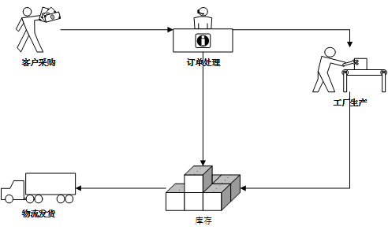
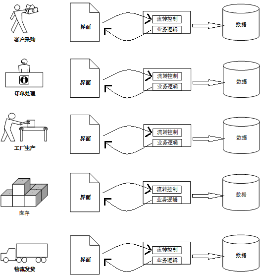
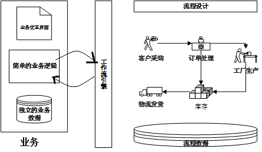

# 工作流

## 一、什么是工作流

历史发展：

> 工作流的理论起源于70年代中期办公的自动化领域。90年代。工作流技术的研究与开发进一步发展。1993年8月，成立第一个工作流技术标准话的工业组织WFMC（工作流管理联盟）。现在，工作流管理系统已由最初的无纸化办公环境，转而成为企业试下业务流程自动执行的必要工具。

定义：

> WFMC:工作流是指一类能够完全自动执行的经营过程，根据一系列的过程规则，将文档、信息或任务在不同的执行者之间进行传递与执行。

> Georgakopoulos:工作里是将一组任务组织起来以完成某一个经营过程（定义了任务的触发顺序和触发条件，每一个任务可以由一个或多个软件系统完成，也可以由一个或一组人完成，还可以由一个或者多个人与软件系统协作完成）。

> 百度百科：工作流（WorkFlow），就是“业务过程的部分或整体在计算机应用环境下的自动化”。它主要解决的是“是在多个参与者之间按照某种预定义的规则传递文档、信息或任务的过程自动进行，从而实现某个预期的业务目标，或者促使次目标的实现”。

## 二、工作流管理系统WFMS

工作流管理系统（Workflow Management System，WFMS）是一个软件系统，它完成工作量的定义和管理，并按照在系统中预定义的工作流规则进行工作流实例的执行。工作流管理系统不是企业的业务系统，而是为企业的业务系统的运行提供了一个软件的支撑环境。

## 三、工作流管理联盟WFMC

工作流管理联盟（Workflow Management Coalition，WFMC）是一个由设计工作里和业务流程管理的全球性组织。该组织创建并完善了工作流的相关标准，开阔了相关市场，是唯一的致力于工作流标准化的专业组织。该组织推出了工作流XML（Wf-XML）和XML过程定义语言(XPDL)，现在由超过80种有名的解决方案中使用了这两种语言来存储和交换过程模型。

## 四、为什么要使用工作流？

我们来看一下这样一个业务场景。一个订货流程.

（1）.客户提交订单  （2）.业务员执行订单处理  （3）.如果缺货，转工厂生产  （4）.仓库发货  （5）.物流发货

不使用工作流，我们从头开发这个订货流程的业务逻辑，我们需要做哪些事？
 1. 每一个活动点都需要开发交互界面和后台处理程序。
 2. 每个活动的流转都需要硬性判断下一步活动节点及其操作人
 3. 每次操作都需要维护业务数据和流程的相关数据

结果应该是这样：这还不包括监视、控制、分析流程的部分。

如果我们使用了工作流，结果应该是这样：

这样做的好处有哪些：

1. 使用专门的流程数据系统，维护所有涉及流程流转的数据。
2. 提供“流程设计”工具，帮助用户定义订货流程的模型，而且一般都提供了可视化的界面。
3. 所有的流程都依靠流程引擎来处理，避免了需求更改与硬编码之间的矛盾的产生。
4. 工作流引擎还提供了众多的API，可以很方便的将工作流的管理和有、任务操作完美结合。

**总结，在核实的项目中引入工作流技术，对于基础开发来说，有这样的一些好处：**

*1. 降低开发风险*

通过使用诸如活动、流转、状态、行为这样的术语，使得业务分析师和开发人员使用同一种语言交流成为可能。优秀的流程实际建模工具，甚至能使开发人员不必将用户需求转化成详细设计文档。

*2. 流程实现的集中统一*

应对业务流程经常变化的情况，使用工作流技术的最大好处是使业务流程的实现代码，不再散落在各式各样的业务系统中。

*3. 加速开发*

开发者不用再关注流程的参与者、活动节点的衔接、流转控制等，因为这些工作很多都被工作流框架接管了。因为开发者开发起来更快、代码出错更少、系统更加容易维护。

*4. 提升对迭代开发的支持*

工作流管理系统使得业务流程很容易不熟和重新编排，业务流程相关的应用开发可以以一种“迭代/渐进”的方式推进，也就是说工作就技术在某种程度上支持“需求分析不必一次完全成功”。

## 五、怎么使用工作流？

**重点：工作流一定要结合业务，单独使用没有任何意义。**

一些建议：

1. 明确工作流适用的行业。
2. 明确关键的业务流程。
3. 选定合适的工作流框架。
4. 工作流一定要结合业务使用。